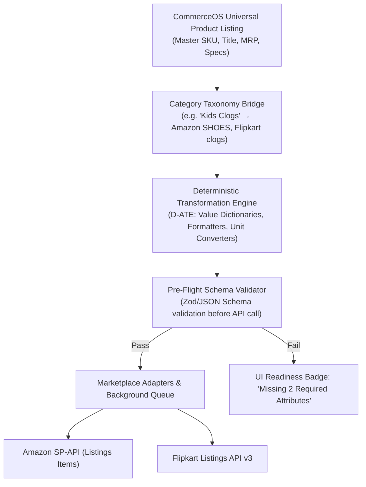

# CommerceOS Universal Listing Engine: Architectural Blueprint & Implementation Specification

> **Status:** Approved Architecture Blueprint  
> **Target Scope:** Single Listing in CommerceOS → Automated Multi-Channel Publishing (Amazon SP-API, Flipkart, Quick-Commerce)  
> **Core Strategy:** **100% Deterministic (Zero-AI Required)**  
> **Reference Page:** [`/products/list`](http://localhost:3000/products/list)  
> **Associated PDF Report:** [`CommerceOS_Universal_Listing_Blueprint.pdf`](file:///c:/Users/suhel/OneDrive/commerceos/docs/commerceos/CommerceOS_Universal_Listing_Blueprint.pdf)

---

## 1. Executive Summary & Feasibility

### Is it possible?
**Yes, 100% possible and proven in production.**  
In the e-commerce industry, this system is known as **PIM (Product Information Management) & Channel Syndication Engine** (the exact architecture used by platforms like *ChannelEngine*, *Feedonomics*, *Sellbrite*, and *Unicommerce*).

### Is AI Required?
**NO, AI is NOT required.** In fact, for production-grade catalog syndication, **avoiding AI in the core mapping pipeline is strongly recommended**:
- **Why Rule-Based (Deterministic) is Superior:**
  1. **Strict JSON Schema Compliance:** Marketplaces like Amazon (SP-API Listings Items 2021-08-01) and Flipkart enforce rigid enumerations (e.g., `color_map: "Blue"`, `outer_material_type: "EVA"`). An LLM guessing or hallucinating non-standard terms causes instant API 400 rejection errors.
  2. **0ms Latency & ₹0 Cost:** Lookup tables and deterministic mappers run in sub-millisecond time with zero recurring LLM token fees.
  3. **100% Predictable & Auditable:** If an attribute transforms incorrectly, it is traced to an exact rule in a dictionary and fixed permanently.
- **Where AI can be an optional add-on (if desired in the future):**
  - Creative copywriting (e.g., generating marketing punchlines or SEO bullet points from raw specs). But the structural attribute transformation engine runs completely without AI.

---

## 2. Analysis of the Current Page (`/products/list`) & Database Models

An in-depth audit of [`app/products/list/page.tsx`](file:///c:/Users/suhel/OneDrive/commerceos/app/products/list/page.tsx) and [`prisma/schema.prisma`](file:///c:/Users/suhel/OneDrive/commerceos/prisma/schema.prisma) shows that **65% of the data structures are already built into CommerceOS**:

### Existing Foundations:
1. **Frontend (`/products/list`):**
   - [`ProductsPage.tsx`](file:///c:/Users/suhel/OneDrive/commerceos/components/products/ProductsPage.tsx): Main table with filters, search, and quick product creation.
   - [`ProductDataTable.tsx`](file:///c:/Users/suhel/OneDrive/commerceos/components/products/table/ProductDataTable.tsx): Renders ATS (Available Stock), pricing, SKU, and marketplace badges (`MarketplaceBadges.tsx`).
   - [`ListingWorkspace.tsx`](file:///c:/Users/suhel/OneDrive/commerceos/components/listings/ListingWorkspace.tsx): Per-product listing workspace with tabs for Overview, Pricing, Inventory, Images, and SEO.
2. **Database Models (`prisma/schema.prisma`):**
   - `Product`: Master catalog record with SKU, name, brand, category, HSN, tax rate, and prices.
   - `MasterListing` & `MasterAttribute`: Stores canonical description, bullet points, and key-value specs.
   - `MarketplaceRegistry`: Pre-configured directory for `AMAZON`, `FLIPKART`, `MEESHO`, etc.
   - `MarketplaceSchema` & `MarketplaceAttributeDefinition`: Official taxonomy & attribute schemas per channel.
   - `MarketplaceCategoryMapping`: Bridges CommerceOS categories to marketplace verticals.
   - `MarketplaceListing`: Stores channel SKU, ASIN/FSN, publish status, and sync errors.

### The Missing Gap:
Currently, there is no automated **Deterministic Attribute Transformation Engine (D-ATE)** or **Pre-Flight Schema Validator** linking the master product directly to channel payloads.

---

## 3. The 4 Deterministic Building Blocks (Zero-AI Architecture)



1. **Category Taxonomy Bridge (N-to-1):**
   - Maps CommerceOS category (`Kids Clogs`) to Amazon Product Type (`SHOES`) and Flipkart Vertical (`footwear/clogs`).
2. **Deterministic Value Dictionaries (Lookup Tables):**
   - If CommerceOS color is `"Navy Blue"`:
     - Amazon expects: `color_name = "Navy Blue"` AND `color_map = "Blue"`
     - Flipkart expects: `color_family = "Blue"` AND `color = "Navy Blue"`
3. **Unit & Formula Normalizers:**
   - Automatically converts centimeters to millimeters or inches and grams to kilograms without guesswork.
4. **Channel-Specific Title & Bullet Point Templates:**
   - Mustache-style deterministic templates:
     - Amazon: `{{brand}} {{name}} for {{gender}} ({{color}}, {{size}})`
     - Flipkart: `{{brand}} {{name}} {{ideal_for}} {{color}}`

---

## 4. 6-Step Implementation Roadmap for CommerceOS

### Step 1: Canonical Master Spec Registry
- Populate `UniversalAttributeRegistry` with standard e-commerce keys: `color`, `size`, `material`, `gender`, `age_group`, `weight_g`, `length_cm`, `width_cm`, `height_cm`, `country_of_origin`, `hsn_code`.
- Add a category-based specification editor in the Product Studio/Detail drawer.

### Step 2: Seed Marketplace Category & Taxonomy Mappings
- Seed `MarketplaceSchema` and `MarketplaceCategoryMapping` with official Amazon SP-API and Flipkart vertical definitions for core categories (Footwear, Apparel, etc.).

### Step 3: Implement the Transformation Engine (`lib/marketplaces/`)
- Write `universal-listing.transformer.ts`:
  - `AmazonAdapter`: Builds SP-API JSON listings payload (schema `2021-08-01`).
  - `FlipkartAdapter`: Builds Flipkart Marketplace v3 listing & price/stock payload.
  - `ValueNormalizer`: Executes dictionary lookups for colors, materials, and sizes.

### Step 4: Pre-Flight Schema Validator (Zero Rejections)
- Before making an external API request, run a local JSON Schema/Zod validator against the payload.
- Flag missing mandatory attributes immediately in the UI with a 1-click quick-fix modal.

### Step 5: UI Integration on `/products/list`
- Add **Channel Readiness Badges** in [`ProductDataTable.tsx`](file:///c:/Users/suhel/OneDrive/commerceos/components/products/table/ProductDataTable.tsx):
  - Green check: `Amazon Ready` / `Flipkart Ready`
  - Amber dot: `Missing 2 Specs (Outer Material, UK Size)`
- Add **Bulk Action: "Publish to Channels"** in `BulkActionBar`.
- Add a drawer tab to view and edit channel-specific overrides if desired.

### Step 6: Asynchronous Dispatch Queue & Error Sync
- Background worker executes `PUT /listings/2021-08-01/items/{sellerId}/{sku}` on Amazon SP-API and Flipkart Listings API.
- Stores external ASIN / FSN and sync status in `MarketplaceListing`.

---

## 5. Payload Transformation Example

### Input: CommerceOS Master Record
```json
{
  "sku": "CLOG-KID-BLU-04",
  "name": "SuperLight Kids Comfort Clog",
  "brand": "CozyStep",
  "category": "Kids Clogs",
  "mrp": 999.00,
  "sellingPrice": 599.00,
  "hsn": "64029990",
  "specs": {
    "color": "Navy Blue",
    "material": "EVA Foam",
    "size": "4 UK",
    "gender": "Boys",
    "sole": "EVA"
  }
}
```

### Auto-Generated Output A: Amazon SP-API (Listings Items API)
```json
{
  "productType": "SHOES",
  "attributes": {
    "item_name": [{ "value": "CozyStep SuperLight Kids Comfort Clog for Boys (Navy Blue, 4 UK)" }],
    "brand": [{ "value": "CozyStep" }],
    "color_name": [{ "value": "Navy Blue" }],
    "color_map": [{ "value": "Blue" }],
    "outer_material_type": [{ "value": "Ethylene Vinyl Acetate" }],
    "footwear_size": [{ "size": "4", "size_system": "uk_footwear_size_system" }],
    "country_of_origin": [{ "value": "IN" }]
  }
}
```

### Auto-Generated Output B: Flipkart Marketplace API v3
```json
{
  "product_id": "CLOG-KID-BLU-04",
  "vertical": "footwear/clogs",
  "attributes": {
    "title": "CozyStep SuperLight Kids Comfort Clog Boys Navy Blue",
    "brand": "CozyStep",
    "color_family": "Blue",
    "color": "Navy Blue",
    "ideal_for": ["Boys"],
    "primary_material": "EVA",
    "size_uk": "4"
  }
}
```
