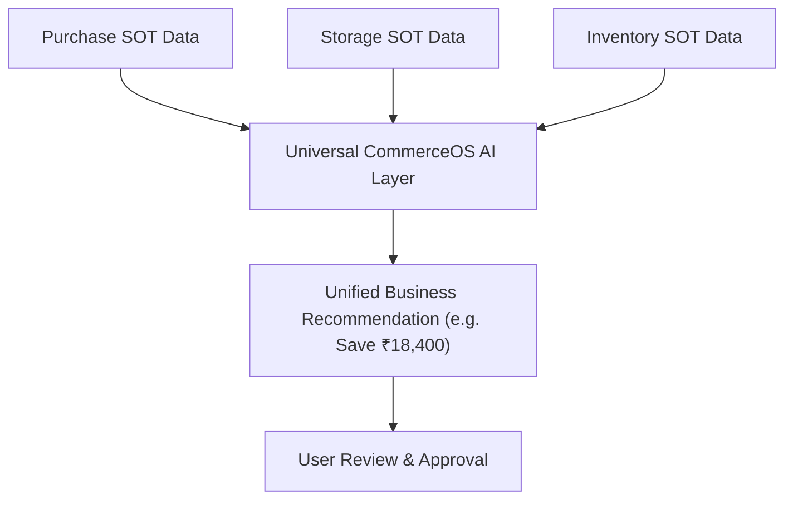

# CommerceOS Universal AI Architecture Blueprint

> **Product & Engineering Vision Document**
> This document records the core design principles, module responsibilities, human-in-the-loop governance rules, and future unified intelligence architecture for CommerceOS AI.

---

## 📌 Core Product Principle: Human-in-the-Loop AI

**AI IS ALWAYS OPTIONAL & ADVISORY — NEVER MUTATING & NEVER AUTONOMOUS.**

1. **No Automatic Execution**: AI will NEVER create a Purchase Order, execute a Stock Transfer, or modify Inventory Balances on its own.
2. **Actionable Financial Value Propositions**: Every AI recommendation must quantify the estimated financial impact before user approval:
   > *“Ye karne se approximately ₹18,400 save ho sakte hain. Review & Apply.”*
3. **User Execution Control**: The user always reviews, decides, and triggers business actions manually.

---

## 🛒 1. Purchase AI Responsibilities

* **Supplier Price Increase Detection**: Detects unit price surges and supplier cost variances across recent GRNs and bills.
* **Smart Reorder Timing**: Predicts optimal reorder dates based on vendor lead times and consumption velocity.
* **Best Supplier & Price Identification**: Compares multi-vendor prices and identifies cost-effective alternatives.
* **Anomaly Detection**: Flags unusual unit prices, quantity spikes, or tax discrepancy patterns in purchase bills.
* **Buy/Wait Advisory**: Recommends *“Abhi buy karo / wait karo”* based on supplier lead times and seasonal price trends.

---

## 📦 2. Storage AI Responsibilities

* **Optimal Stock Location Routing**: Recommends the best physical bin/warehouse location to place incoming stock.
* **Overstock & Capacity Utilization**: Detects under-utilized shelf spaces and overcrowded storage bins.
* **Node Transfer Strategy**: Recommends stock movements (**Home → FBA** / **FBA → Home**) to optimize fulfillment speed and storage fees.
* **Stock Movement Anomaly Detection**: Flags unusual receiving, picking, or location transfer patterns.
* **Storage Cost Reduction**: Identifies opportunities to consolidate bins and minimize warehouse storage fees.

---

## 📊 3. Inventory AI Responsibilities

* **Pre-emptive Stockout & Low-Stock Prediction**: Predicts low-stock and stockout risks before they happen using consumption velocity.
* **Dead & Slow-Moving Stock Recovery**: Identifies non-moving SKUs and suggests liquidation/discounting strategies.
* **Demand-Based Reorder Quantities**: Calculates exact recommended reorder quantities to avoid overstocking capital.
* **Excess Stock Identification**: Highlights capital locked in excess safety stock buffers.
* **Channel Allocation Advisory**: Recommends stock allocation across sales channels (Amazon SP-API, Flipkart FBF, Shopify D2C, Meesho) to maximize Buy Box and conversion.

---

## 🌐 4. The Universal CommerceOS AI Layer (Unified Architecture)

In the future, Purchase AI, Storage AI, and Inventory AI will NOT operate as isolated silos. 

Instead, a single **Universal CommerceOS AI Layer** will connect and cross-analyze data across all three modules:

### Combined Cross-Module Intelligence Examples:
- **Purchase + Storage**: Detects that a vendor PO is arriving on Tuesday and automatically plans bin capacity in Home Storage.
- **Inventory + Storage + Purchase**: Detects Amazon FBA stockout risk, checks Home Storage balances first for transfer, and only if Home Storage is low, generates a Purchase PO recommendation for the exact deficit.

---

*Last Updated: August 2026*
