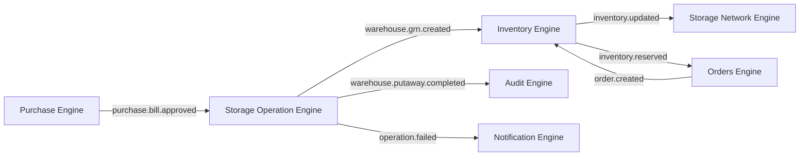
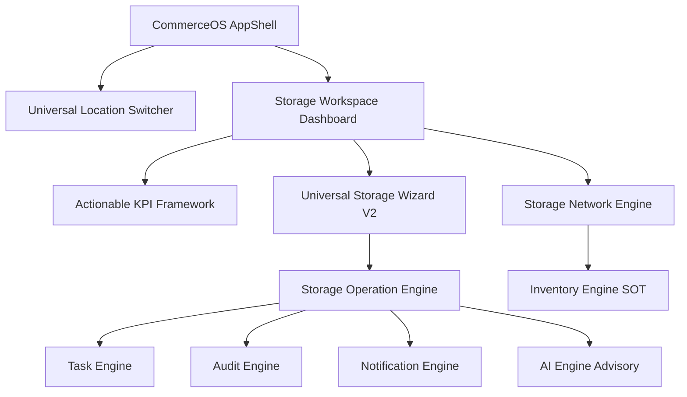

# CommerceOS Architecture Specification v1.0
## Enterprise Technical Constitution (FROZEN)

**Document Status**: FROZEN  
**Version**: 1.0  
**Effective Date**: August 4, 2026  
**Authority**: Chief Software Architect, DDD Solution Architect & Enterprise SaaS Engineering Board  

---

## EXECUTIVE SUMMARY & GOAL

This specification is the permanent, authoritative technical constitution of **CommerceOS**. It defines the engine responsibilities, domain boundaries, Single Source of Truth (SOT) ownership, event pub/sub relationships, dependency hierarchy, capability matrix, and non-negotiable architectural rules. 

Every current component and future module **MUST** strictly adhere to this specification without exception. Any architectural deviation requires a formal Architecture Review, version increment, and engineering board sign-off.

---

## SECTION 1: PLATFORM PHILOSOPHY

### 1.1 Operating System Mandate
CommerceOS is an **Ecommerce Operating System**, NOT a standalone ERP, inventory counter, listing tool, or traditional WMS. It acts as the execution substrate connecting physical storage nodes, marketplace channels, procurement supply chains, financial accounting, and operational workflows into a single unified runtime.

```
┌─────────────────────────────────────────────────────────────────────────┐
│                        CommerceOS AppShell                              │
├──────────────┬──────────────┬──────────────┬──────────────┬─────────────┤
│  Purchase    │  Inventory   │   Storage    │   Orders     │   Finance   │
│   Engine     │   Engine     │ Network Eng. │   Engine     │   Engine    │
├──────────────┴──────────────┴──────────────┴──────────────┴─────────────┤
│                    Storage Network Operation Engine                     │
├─────────────────────────────────────────────────────────────────────────┤
│    Task Engine  │  Audit Engine  │  Notification Engine  │  AI Engine   │
└─────────────────────────────────────────────────────────────────────────┘
```

### 1.2 Core Design Principles
1. **Single Source of Truth (SOT)**: Every piece of data has exactly ONE owning engine. No duplicate calculations or dual state.
2. **Capability-Driven UI**: Feature availability is governed by dynamic capabilities, never by hardcoded seller tier flags.
3. **Progressive Complexity**: Interface complexity expands gracefully from Solo (<60s tasks) to Growing D2C to Enterprise WMS.
4. **API-First Architecture**: Every UI action executes via underlying domain engine APIs.
5. **AI Optional & Non-Blocking**: AI never owns business data or blocks execution; it only predicts, optimizes, and advises.
6. **Offline Ready & Reactive**: Real-time state updates with optimistic local UI mutations backed by domain event persistence.
7. **Marketplace Agnostic**: Abstracted adapters isolate core domain engines from channel-specific API quirks.
8. **Modular & Domain-Driven (DDD)**: Strict bounded contexts isolate domains through clean event contracts.

---

## SECTION 2: CORE ENGINES & DOMAIN RESPONSIBILITIES

### 2.1 Engine Matrix

| Engine | Purpose | Owns (SOT) | NEVER Owns | Key Dependencies | Primary Events Published |
| :--- | :--- | :--- | :--- | :--- | :--- |
| **Purchase Engine** | Procurement & VENDOR Management | Purchase Bills, POs, Vendor Records, Payment Terms | Stock On-Hand, Bin Locations | Finance Engine | `purchase.bill.created`, `purchase.bill.approved` |
| **Inventory Engine** | Stock Balances & SOT Valuation | Stock Quantities (*Available, Reserved, Incoming, Damaged, ATS*) | Storage Bins, Bin Maps | None (Core SOT) | `inventory.updated`, `inventory.adjusted` |
| **Storage Network Engine** | Storage Registry & Topology | Location Records, Relationships, Health, Capabilities | Stock Quantities | Inventory Engine | `storage.location.created`, `storage.health.updated` |
| **Storage Operation Engine** | Warehouse Workflow Execution | Operations Queue (*Receiving, GRN, QC, Putaway, Transfers, Cycle Counts*) | Stock Quantities, User Accounts | Storage Network, Inventory | `warehouse.receiving.completed`, `warehouse.qc.completed`, `warehouse.putaway.completed` |
| **Products Engine** | Master Catalog & SKU Definitions | Master SKUs, Variants, Attributes, Cost Prices | Channel Prices, Channel Listings | None | `product.created`, `product.updated` |
| **Listings Engine** | Channel Catalog Mapping | Channel SKU Mappings, Marketplace Listing Status | Master Product Catalog | Products Engine | `listing.mapped`, `listing.synced` |
| **Orders Engine** | Sales & Order Lifecycle | Customer Orders, Line Items, Fulfillment Status | Stock Balances, Accounting Ledgers | Inventory, Listings | `order.created`, `order.reserved`, `order.shipped` |
| **Returns Engine** | Customer Returns & RMA | RMA Tickets, Return Shipments, Inspection Status | Stock Quantities | Orders, Storage Operation | `return.created`, `return.inspected` |
| **Finance Engine** | Double-Entry Accounting & Ledger | General Ledger, COGS, Accounts Payable/Receivable | Warehouse Operations | Purchase, Orders | `finance.journal.posted`, `finance.cogs.recorded` |
| **Reports Engine** | Business Intelligence & Analytics | Aggregated BI Metrics, Analytical Snapshots | Operational Live State | All Domain Engines | `report.generated` |
| **AI Engine** | Non-blocking Optimization | Recommendations, Demand Forecasts, Velocity Insights | Raw Master Data | All Domain Engines | `ai.recommendation.generated` |
| **Task Engine** | Work Assignment & Personnel | Work Tasks, User Assignments, SLA Deadlines | Business Workflows | Storage Operation | `task.created`, `task.completed` |
| **Notification Engine** | Cross-Channel Communication | In-App Alerts, Email, SMS, Webhooks | Business Data State | Task, Audit | `notification.sent` |
| **Audit Engine** | Historical Audit Trail | Immutable Event Timelines, Change Logs | Active Domain State | All Domain Engines | `audit.event.logged` |
| **Capability Engine** | Matrix Capability Evaluation | Feature Capabilities per Stage & Node Type | Business Data | None | `capability.evaluated` |

---

## SECTION 3: SINGLE SOURCE OF TRUTH (SOT) CONSTITUTION

```
Inventory Engine  ──► Owns QUANTITY (Available, Reserved, Incoming, Damaged, ATS)
Storage Network   ──► Owns LOCATION (Nodes, Racks, Bins, Network Topology)
Storage Operation ──► Owns EXECUTION (Receiving, GRN, QC, Putaway, Transfers)
Orders Engine     ──► Owns RESERVATIONS (Order Status & Customer Reservations)
Finance Engine    ──► Owns ACCOUNTING (General Ledger, COGS, Cash Flow)
Purchase Engine   ──► Owns PROCUREMENT (Vendor Bills, Inbound POs)
Task Engine       ──► Owns PEOPLE & ASSIGNMENTS (User Work Items)
Audit Engine      ──► Owns HISTORY (Immutable Timelines)
AI Engine         ──► Owns RECOMMENDATIONS (Advisory Insights)
```

**Rule 3.1**: No engine may calculate, store, or mutate data owned by another engine. All state transitions must occur via explicit domain events or owner engine APIs.

---

## SECTION 4: DOMAIN EVENTS CONTRACT



### 4.1 Event Catalog
- `purchase.bill.created`: Published by Purchase Engine on bill draft.
- `purchase.bill.approved`: Published by Purchase Engine; triggers Receiving Operation in Storage Operation Engine.
- `warehouse.receiving.started`: Published by Storage Operation Engine on dock check-in.
- `warehouse.grn.created`: Published by Storage Operation Engine on GRN sign-off; triggers Inventory Engine stock increment.
- `warehouse.qc.completed`: Published by Storage Operation Engine; updates damaged/sellable classification in Inventory Engine.
- `warehouse.putaway.completed`: Published by Storage Operation Engine on bin placement.
- `inventory.updated`: Published by Inventory Engine whenever ATS or reserved balances change.
- `inventory.adjusted`: Published by Inventory Engine on cycle count or manual adjustment.
- `order.created`: Published by Orders Engine on customer purchase.
- `order.reserved`: Published by Inventory Engine after successfully reserving stock for an order.
- `order.shipped`: Published by Orders Engine on dispatch sign-off.
- `return.created`: Published by Returns Engine on RMA creation.

---

## SECTION 5: ENGINE DEPENDENCY RULES

### 5.1 Permitted Dependency Chain
```
Purchase Engine ──► Inventory Engine ──► Storage Network Engine ──► Storage Operation Engine ──► Orders Engine ──► Finance Engine ──► Reports Engine ──► AI Engine
```

### 5.2 Forbidden Dependency Rules
1. **No Circular Dependencies**: Lower-level engines (Inventory, Storage Network) MUST NEVER import or depend on higher-level engines (Finance, Reports, AI).
2. **AI Independence**: Core business logic MUST NEVER depend on AI Engine outputs. If AI Engine is offline, the platform MUST function with 100% operational parity using standard deterministic rules.

---

## SECTION 6: DATABASE OWNERSHIP & POSTGRESQL SCHEMAS

### 6.1 Entity Ownership Map

```sql
-- Inventory Engine (SOT for Quantities)
CREATE TABLE stock_balances (
    id UUID PRIMARY KEY,
    tenant_id UUID NOT NULL,
    sku VARCHAR(64) NOT NULL,
    available_qty INT NOT NULL DEFAULT 0,
    reserved_qty INT NOT NULL DEFAULT 0,
    incoming_qty INT NOT NULL DEFAULT 0,
    damaged_qty INT NOT NULL DEFAULT 0,
    created_at TIMESTAMPTZ NOT NULL,
    updated_at TIMESTAMPTZ NOT NULL
);

-- Storage Network Engine (SOT for Location Topology)
CREATE TABLE storage_locations (
    id UUID PRIMARY KEY,
    tenant_id UUID NOT NULL,
    type VARCHAR(32) NOT NULL,
    code VARCHAR(32) NOT NULL,
    name VARCHAR(128) NOT NULL,
    status VARCHAR(16) NOT NULL DEFAULT 'active',
    address_json JSONB,
    capacity_json JSONB,
    created_at TIMESTAMPTZ NOT NULL
);

CREATE TABLE storage_relationships (
    id UUID PRIMARY KEY,
    source_location_id UUID REFERENCES storage_locations(id),
    destination_location_id UUID REFERENCES storage_locations(id),
    relationship_type VARCHAR(32) NOT NULL,
    lead_time_days INT DEFAULT 0,
    created_at TIMESTAMPTZ NOT NULL
);

-- Storage Operation Engine (SOT for Process Execution)
CREATE TABLE storage_operations (
    id UUID PRIMARY KEY,
    tenant_id UUID NOT NULL,
    location_id UUID REFERENCES storage_locations(id),
    operation_type VARCHAR(32) NOT NULL,
    status VARCHAR(16) NOT NULL DEFAULT 'queued',
    priority VARCHAR(16) NOT NULL DEFAULT 'medium',
    assigned_user_id UUID,
    sku VARCHAR(64),
    qty INT,
    created_at TIMESTAMPTZ NOT NULL,
    completed_at TIMESTAMPTZ
);
```

---

## SECTION 7: MODULE BOUNDARIES

- **Products**: Catalog definitions, variant structures, dimensions, weight.
- **Purchase**: Vendor bills, POs, landed costs, inbound tracking.
- **Inventory**: Quantity balances, ATS calculations, valuation.
- **Storage**: Location topology, physical bin maps, execution operations queue.
- **Listings**: Channel mappings, listing price rules, marketplace status.
- **Orders**: Sales orders, fulfillment statuses, customer routing.
- **Returns**: Customer RMAs, inspection routing, vendor return claims.
- **Finance**: General ledger, accounts payable/receivable, P&L.
- **Reports**: BI dashboards, velocity analysis, turnover metrics.
- **AI**: Non-blocking recommendations and predictive forecasts.

---

## SECTION 8: CAPABILITY ENGINE ARCHITECTURE

Features are granted dynamically via Capability Matrices, NEVER via seller tier flags (`isSolo` or `isEnterprise`).

```
                              ┌────────────────────────┐
                              │  Capability Engine     │
                              └───────────┬────────────┘
                                          │ Evaluates Matrix
              ┌───────────────────────────┼───────────────────────────┐
              ▼                           ▼                           ▼
    [Solo / Starter Node]      [Growing D2C Node]          [Enterprise WMS Node]
    - inventory_balance        - inventory_balance         - inventory_balance
    - damage_qc                - damage_qc                 - damage_qc
    - cycle_count              - receiving_grn             - receiving_grn
                               - putaway_slotting          - putaway_slotting
                               - marketplace_sync          - qc_inspection
                                                           - digital_twin_layout
                                                           - hardware_integration
```

---

## SECTION 9: AI PRINCIPLES

1. **Optional & Non-Blocking**: AI failures MUST NEVER block user operations.
2. **Advisory Only**: AI predicts, recommends, and explains. AI NEVER auto-executes stock transfers or changes quantities without explicit user sign-off.
3. **Zero Data Ownership**: AI Engine owns zero core business data.

---

## SECTION 10: UI PRINCIPLES & ACTIONABLE KPI FRAMEWORK

1. **Universal Actionable KPI Standard**: NO KPI is read-only. Every metric MUST answer:
   - *"What does this number mean?"*
   - *"What action can I take right now?"*
2. **Progressive Disclosure**: High-frequency actions are accessible in 1-click. Advanced WMS forms expand progressively.
3. **Single AppShell**: All modules render within the unified CommerceOS AppShell beneath `TopNavbar`.

---

## SECTION 11: WAREHOUSE & STORAGE ARCHITECTURE

```
Storage Network Engine (Topology SOT)
  ├── Storage Location Registry (Home, Warehouse, Amazon FBA, Flipkart FBF, 3PL, Factory, Retail)
  ├── Relationship Graph (Replenishes, Supplies, Transfers, Feeds, Ships_To)
  └── Operational Health Calculator (Receiving/QC Backlog, Capacity %, Hardware Status)

Storage Operation Engine (Execution SOT)
  ├── Operations Queue (Receiving, GRN, QC Inspection, Putaway, Transfers, Cycle Counts, Adjustments)
  ├── Auto Layout Generator (Floor → Zone → Row → Rack → Shelf → Bin)
  └── Barcode Engine (GS1, SSCC, LPN Ready Barcode IDs)
```

---

## SECTION 12: MARKETPLACE & FULFILLMENT ADAPTERS

Marketplace channel integration relies on decoupled Adapters (*Amazon SP-API Adapter, Flipkart FBF Adapter, Meesho Adapter, Shopify Adapter, Custom 3PL Adapter*).

Adapters translate channel-specific inventory payloads into standardized `inventory.updated` and `order.created` domain events without leaking channel logic into core engines.

---

## SECTION 13: SECURITY & MULTI-TENANCY

1. **Tenant Isolation**: Every database query and event MUST include `tenant_id`. Cross-tenant data leaks are impossible by design.
2. **Role-Based Access Control (RBAC)**: Fine-grained permissions (*Manager, Receiver, QC Staff, Picker, Packer, Auditor, Read Only*).
3. **Audit Trail**: Every mutation logs `executed_by`, `ip_address`, `timestamp`, and `audit_reference`.

---

## SECTION 14: EXTENSION RULES FOR FUTURE MODULES

When adding a future module (e.g., *Manufacturing Engine, Dark Store Quick-Commerce Engine*):
1. Identify SOT data ownership before writing code.
2. Define domain events for cross-engine communication.
3. Ensure no circular dependencies are introduced.
4. Verify functionality works for Solo sellers without forcing Enterprise overhead.

---

## SECTION 15: THE 7 NON-NEGOTIABLE COMMANDMENTS

```
┌─────────────────────────────────────────────────────────────────────────────┐
│                       THE 7 PLATFORM COMMANDMENTS                           │
├─────────────────────────────────────────────────────────────────────────────┤
│ 1. Inventory Engine ALWAYS owns stock quantities.                           │
│ 2. Storage Network Engine ALWAYS owns location topology.                    │
│ 3. Storage Operation Engine ALWAYS owns workflow execution.                 │
│ 4. Task Engine ALWAYS owns work & personnel assignment.                     │
│ 5. Audit Engine ALWAYS owns historical timelines.                           │
│ 6. Notification Engine ALWAYS owns communications & alerts.                 │
│ 7. AI Engine ALWAYS owns advisory recommendations (NEVER blocks execution).  │
└─────────────────────────────────────────────────────────────────────────────┘
```

---

## SECTION 16: PLATFORM ROADMAP STATUS

- **COMPLETED (v1.0)**:
  - AppShell & Design System Alignment.
  - SOT Inventory Engine Integration.
  - Universal Actionable KPI Standard.
  - Universal Storage Location Wizard V2 (15-Step System & Auto Layout Generator).
  - Storage Network Engine V3 (Registry, Relationships Graph, Health Engine).
  - Storage Operation Engine V1 (Execution Queue & Audit Timelines).
- **PLANNED (v1.1)**:
  - PostgreSQL ORM Entity Migration.
  - Advanced 3D Digital Twin Canvas Rendering.
  - Native GS1 Barcode Hardware Scanner Driver Integration.

---

## SECTION 17: HIGH-LEVEL ARCHITECTURE MERMAID DIAGRAMS

### 17.1 Platform Architecture Overview


---

## SECTION 18: ARCHITECTURE REVIEW CHECKLIST

Before approving any new feature or module PR, the reviewer MUST verify:

- [x] **Data Ownership**: Does this feature specify exactly which engine owns the SOT data?
- [x] **SOT Violation Check**: Does it duplicate stock balances or location state?
- [x] **Dependency Check**: Does it introduce circular dependencies?
- [x] **AI Independence**: Will the feature work 100% cleanly if AI is disabled?
- [x] **Capability Check**: Is it controlled by the Capability Engine rather than a hardcoded `isSolo` check?
- [x] **Scalability Check**: Can a Solo seller complete it in <60 seconds while an Enterprise seller gets full configuration?

---

**FINAL STATUS**: **FROZEN**  
*Changes require Architecture Board review and formal version increment.*
