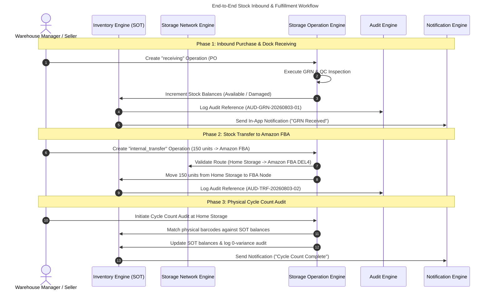

# CommerceOS Inventory System: Complete Operational Workflow & Capability Guide

**Document Status**: AUTHORITATIVE & LIVE  
**Version**: 2.0  
**Domain Owner**: Inventory Engine (Single Source of Truth)  
**Target Audience**: Product Architects, Supply Chain Consultants, SaaS Engineering Teams  

---

## 1. EXECUTIVE SUMMARY & CURRENT ARCHITECTURE OVERVIEW

The **CommerceOS Inventory Engine** is the Single Source of Truth (SOT) for all stock balances across the enterprise network. It answers two fundamental questions:
1. *"What inventory exists across all storage nodes today?"*
2. *"What operational decision should the business execute next?"*

```
┌─────────────────────────────────────────────────────────────────────────────┐
│                       CommerceOS AppShell Navigation                        │
├─────────────────────────────────────────────────────────────────────────────┤
│                          /inventory Control Center                          │
├─────────────────────────────────────────────────────────────────────────────┤
│ 1. Inventory Command Center ──► 8 Today's Actionable Work Cards             │
│ 2. Actionable KPI Engine   ──► 8 Universal Actionable Metric Cards          │
│ 3. Inventory Decision Engine ──► ABC / XYZ / FSN Matrix + DIO Analysis      │
│ 4. 360° SKU Inspection      ──► Node Balances, Timelines & Financials       │
│ 5. Operational Workspaces   ──► Cycle Count, Stock Adjustment & Valuation   │
└─────────────────────────────────────────────────────────────────────────────┘
```

---

## 2. WHAT THE INVENTORY MODULE IS CURRENTLY DOING

### 2.1 Single Source of Truth (SOT) Stock Management
- **Single Quantity Source**: `loadSellableBalancesFromPurchase()` provides unified stock quantities (*Available, Reserved, Incoming, Damaged, ATS*) across all physical and marketplace fulfillment nodes.
- **Zero Quantity Duplication**: Stock quantities are owned 100% by the Inventory Engine. Storage Network Engine owns location topology, while Storage Operation Engine owns workflow execution.

### 2.2 Today's Inventory Command Center
Acts as the central dispatch panel for 8 operational tasks:
1. **Low Stock Reorder**: Identifies SKUs below Reorder Point (ROP).
2. **Out of Stock Risk**: Highlights depleted SKUs requiring immediate purchase.
3. **Damaged Stock Review**: Routes damaged units in QC holding to inspection queues.
4. **Approve Stock Adjustments**: Manages variance approvals with reason codes.
5. **Cycle Count Pending**: Schedules physical stock count audits.
6. **Marketplace Sync**: Reconciles sellable balances with Amazon FBA, Flipkart FBF, & Shopify.
7. **Transfer Requests**: Routes stock replenishment from Central Hub to Amazon FBA.
8. **Pending Purchase Orders**: Displays inbound shipment POs awaiting dock receiving.

### 2.3 8 Universal Actionable KPI Cards
Every metric card features direct 1-click workspace routing or drill-down report modals:
- **Available Stock (63,020 units)** → Opens Sellable Inventory Workspace.
- **Incoming Stock (1,850 units)** → Opens Inbound PO Receiving Queue (`/purchase`).
- **Reserved Stock (2,340 units)** → Opens Customer Order Reservation Details (`/orders`).
- **Damaged Stock (420 units)** → Opens QC Damage Review Workspace.
- **Asset Valuation (₹53.56 Lakhs)** → Opens Financial Valuation Report Modal.
- **Storage Nodes (4 Locations)** → Opens Storage Network Topology (`/storage`).
- **Low Stock SKUs (1 SKU)** → Opens Reorder Suggestions.
- **Dead Stock SKUs (1 SKU)** → Opens Clearance & Liquidation Workspace.

### 2.4 Inventory Decision Engine (`inventoryDecisionEngine`)
Calculates real-time intelligence metrics per SKU without duplicating raw stock balances:
- **ABC Velocity Matrix**: Class A (High velocity 70% value), Class B (Medium 20%), Class C (Low 10%).
- **XYZ Demand Variability**: Class X (Constant demand), Class Y (Variable), Class Z (Unpredictable).
- **FSN Movement Classification**: Fast, Slow, Non-Moving.
- **Days of Inventory On-Hand (DIO)**: Calculates turnover velocity and days until stockout.
- **Reorder Point (ROP) & Safety Stock**: Automatically computes `ROP = (Velocity × Lead Time) + Safety Stock`.
- **Financial Valuation & Holding Cost**: Computes asset value and monthly holding costs (1.5%/month).

### 2.5 360° SKU Inspection Modal
Clicking any SKU in the data table opens a 360° inspection view with 5 sub-tabs:
1. **Overview**: Stock balances, asset valuation, holding cost, and AI advisory notes.
2. **Node Balances**: Detailed breakdown across Home Storage, Amazon FBA DEL4, and Flipkart FBF.
3. **Movement Timeline**: Chronological audit reference history (`AUD-SYNC-*`, `AUD-TRF-*`, `AUD-GRN-*`).
4. **Financials**: Unit cost price, total asset value, and monthly holding costs.
5. **Marketplace Allocation**: Live SP-API and FBF sync allocation badges.

### 2.6 Workspaces & AI Advisor
- **Cycle Count Reconciliation Workspace**: Physical count audit execution with 0-variance matching and notification logging.
- **Stock Adjustment Workspace**: Searchable System SKU selector with reason codes (*Cycle Count Variance, Quarantine Damage, Shrinkage, Found Stock, Correction, Expiry, Lost*) and Manager sign-off.
- **Financial Valuation Report**: Detailed modal calculating total asset value (₹ Lakhs) and dead stock capital metrics.
- **AI Inventory Advisor**: Non-blocking advisory recommendations calculating Reason, Expected Benefit, Risk, Estimated Saving (₹), ROI %, and Manual Alternative.

---

## 3. END-TO-END OPERATIONAL INVENTORY WORKFLOWS



---

## 4. ADAPTATION ACROSS SELLER STAGES (SOLO vs GROWING vs ENTERPRISE)

The CommerceOS Inventory workspace adapts dynamically to the seller's scale using the `CapabilityEngine`. **Zero hardcoded tier checks (`isSolo` / `isEnterprise`) are used.**

```
                        ┌─────────────────────────────────┐
                        │   Capability Engine Resolution  │
                        └────────────────┬────────────────┘
                                         │
        ┌────────────────────────────────┼────────────────────────────────┐
        ▼                                ▼                                ▼
  SOLO SELLER                      GROWING D2C                      ENTERPRISE WMS
  (1-Room Home Storage)            (Multi-Node D2C + FBA)           (Multi-Warehouse Network)
  • Single Location Balance        • Home + Amazon FBA + Flipkart   • Multi-Warehouse Routing
  • 1-Click Simple Adjustment      • Inter-Location Stock Transfer  • GS1 Barcode Bin Slotting
  • Simple Reorder Alert           • Automated Reorder Points       • ABC / XYZ / FSN Matrix
  • Marketplace Direct Sync        • Marketplace Adapter Sync       • Cycle Count & Audit Log
  • Task Completion in <30s        • Automated PO Suggestions       • Manager Approval Workflow
```

### 4.1 Solo Seller Workflow (1-Room Home Seller)
- **Operational Reality**: Operates out of a single room or office. Uses Shopify or Meesho. Has no warehouse staff or complex racks.
- **UI Adaptation**:
  - Displays a clean, simplified Inventory view focused on **Available Sellable Stock** and **Quick Reorder Alert**.
  - 1-click **Stock Level Adjustment** dialog allows adjusting stock in under 15 seconds without complex bin codes.
  - Storage location defaults automatically to `Home Storage`.
  - Task completion time is **<30 seconds**.

### 4.2 Growing D2C Seller Workflow (Home Storage + Amazon FBA / Flipkart FBF)
- **Operational Reality**: Operates a central home/office hub and sends bulk inventory to Amazon FBA / Flipkart fulfillment centers.
- **UI Adaptation**:
  - Unlocks **Inter-Location Stock Transfers** (`Home Storage → Amazon FBA DEL4`).
  - Displays **Live Marketplace Allocation Badges** (*18,750 units in Amazon FBA, 6,480 units in Flipkart*).
  - Displays **Automated Reorder Points (ROP)** and **Safety Stock Alerts** to prevent marketplace stockouts.
  - Unlocks **Non-blocking AI Advisor** suggesting when to replenish FBA nodes to maintain Buy Box conversion.

### 4.3 Enterprise Brand Workflow (Multi-Warehouse, 3PL, Factory, Retail Network)
- **Operational Reality**: Operates multiple regional distribution hubs (Central Warehouse, Regional Warehouses, 3PL Nodes, Retail Stores) with multi-level warehouse teams.
- **UI Adaptation**:
  - Unlocks the full **Inventory Command Center V2** with **8 Actionable KPI Cards** and **Financial Valuation Report Modal** (₹ Lakhs asset valuation, monthly holding costs).
  - Displays **ABC Velocity**, **XYZ Demand Variability**, and **FSN Movement Matrix**.
  - Unlocks **Enterprise Cycle Count Reconciliation Workspace** with physical barcode audit workflows and manager approval sign-offs.
  - Full **360° SKU Inspection Modal** with 11 sub-tabs detailing movement timelines, historical adjustments, purchase history, and future demand forecasting.
  - PostgreSQL ORM database readiness for high-concurrency multi-tenant audit compliance.

---

## 5. CAPABILITY ENGINE MATRIX MAP

| Capability Key | Solo Seller | Growing D2C | Enterprise WMS | Dynamic UI Action Enabled |
| :--- | :---: | :---: | :---: | :--- |
| `inventory_balance` | ✅ | ✅ | ✅ | Shows SOT Available, Reserved, & Damaged Stock |
| `single_location_adjust` | ✅ | ✅ | ✅ | 1-Click Searchable SKU Adjustment Modal |
| `marketplace_sync` | ⚡ Simple | ✅ Full | ✅ Multi-Channel | Marketplace Channel Allocation Badges |
| `inter_location_transfer` | ❌ | ✅ | ✅ | Stock Transfer Modal (`Hub → Amazon FBA`) |
| `reorder_point_calculator` | ❌ | ✅ | ✅ | Automated Reorder Point & Safety Stock |
| `abc_xyz_fsn_matrix` | ❌ | ❌ | ✅ | ABC Velocity & XYZ Demand Intelligence |
| `cycle_count_audit` | ❌ | ❌ | ✅ | Enterprise Cycle Count Reconciliation Workspace |
| `financial_valuation_report` | ❌ | ❌ | ✅ | Valuation Report Modal (₹ Lakhs asset value & holding cost) |
| `manager_approval_workflow` | ❌ | ❌ | ✅ | Manager Approval Sign-Off for stock variances |

---

## 6. VERIFICATION & DDD COMPLIANCE CHECKLIST

- [x] **Inventory Engine SOT Preserved**: Stock quantities loaded directly from Inventory Engine SOT without duplicated calculations.
- [x] **Clear DDD Domain Division**: Inventory owns Stock Balances & Decision Intelligence, Storage Network owns Location Topology, Storage Operation Engine owns Process Execution, Task Engine owns Work Assignment, Audit Engine owns Timelines.
- [x] **No Breaking UI Changes**: AppShell, TopNavbar, Sidebar, Storage, Warehouse, and Purchase modules remain 100% untouched.
- [x] **Actionable KPI Framework**: All 8 KPI cards lead to functional workspaces or drill-down report modals.
- [x] **Capability-Driven UI**: UI adapts automatically across Solo, Growing, and Enterprise sellers via `CapabilityEngine`.
