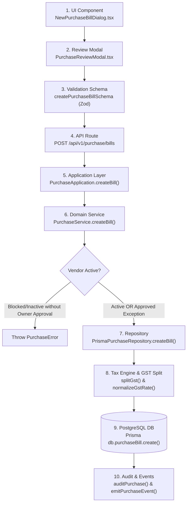
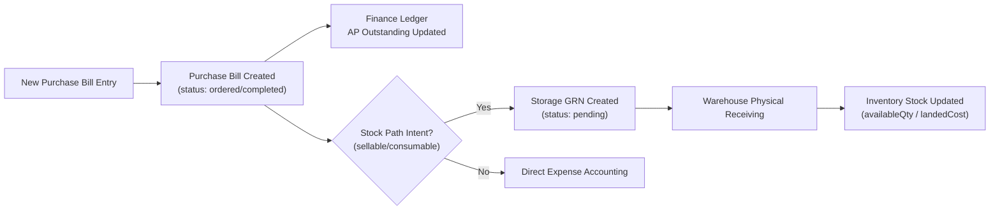

# CommerceOS New Purchase Bill Field Audit

> [!IMPORTANT]
> **READ-ONLY FIELD & ARCHITECTURE AUDIT**
> This document represents the authoritative, single-source-of-truth field audit for the CommerceOS New Purchase Bill entry workflow. No code, database schemas, APIs, UI components, or Excel importers have been modified.

---

## 1. Executive Summary

This audit comprehensively maps the complete end-to-end data lifecycle of the **New Purchase Bill Entry** in CommerceOS across the UI, Validation Schema, API Routes, Application Layer, Domain Service, Repository, and PostgreSQL Database (Prisma).

### Key Audit Metrics
- **Total Bill-Level Fields**: 27 (18 direct input/lookup, 9 calculated/generated)
- **Total Line-Level Fields**: 18 (10 direct input/lookup, 8 calculated/generated)
- **Total Charge Fields**: 4 (`discountAmount`, `freightAmount`, `allocateFreightToLandedCost`, `otherCharges`)
- **Total Payment Fields**: 6 (`paymentMethod`, `paymentId`, `amountPaid`, `paymentDate`, `paymentStatus`, `instantSettlement`)
- **Total Attachment Fields**: 3 (`billUploadName`, `attachments` array, attachment file object)
- **Total Calculated Fields**: 17 (Subtotal, Taxable Value, CGST, SGST, IGST, Tax Amount, Tax Percent, Round Off, Total Amount, Line Amount, Line Taxable Value, Line CGST, Line SGST, Line IGST, Line Tax Amount, Line Freight Allocation, Line QC Status)
- **Total Database-Lookup Fields**: 6 (`vendorId` -> Vendor Master, `productId` -> Product Master, `buyerStateCode` -> Business Profile, `vendorStateCode` -> Vendor GSTIN, `poReference` -> PO Master, `approvalId` -> Vendor Approval Request)
- **Total System-Generated Fields**: 9 (`id`, `billNumber`, `createdAt`, `updatedAt`, `createdBy`, `createdByName`, `isDeleted`, Line `id`, Attachment `id`)
- **Total Required UI Fields**: 3 (`vendorId`, `billDate`, Line `description`)
- **Total Optional UI Fields**: 22

---

## 2. Actual New Bill Entry Flow

The runtime execution path for creating a new purchase bill follows a strict layered architecture:

### Source File Trace
1. **UI Layer**: [`components/purchase/NewPurchaseBillDialog.tsx`](file:///c:/Users/suhel/OneDrive/commerceos/components/purchase/NewPurchaseBillDialog.tsx)
2. **Review & Impact Modal**: [`components/purchase/PurchaseReviewModal.tsx`](file:///c:/Users/suhel/OneDrive/commerceos/components/purchase/PurchaseReviewModal.tsx)
3. **Validation Schema**: [`lib/validation/purchase.schema.ts`](file:///c:/Users/suhel/OneDrive/commerceos/lib/validation/purchase.schema.ts) (`createPurchaseBillSchema`)
4. **API Route**: [`app/api/v1/purchase/bills/route.ts`](file:///c:/Users/suhel/OneDrive/commerceos/app/api/v1/purchase/bills/route.ts)
5. **Application Layer**: [`lib/application/purchase.application.ts`](file:///c:/Users/suhel/OneDrive/commerceos/lib/application/purchase.application.ts) (`PurchaseApplication`)
6. **Service Layer**: [`lib/purchase/service.ts`](file:///c:/Users/suhel/OneDrive/commerceos/lib/purchase/service.ts) (`PurchaseService`)
7. **Repository Layer**: [`lib/purchase/repository.ts`](file:///c:/Users/suhel/OneDrive/commerceos/lib/purchase/repository.ts) (`PrismaPurchaseRepository`)
8. **Prisma Models**: [`prisma/schema.prisma`](file:///c:/Users/suhel/OneDrive/commerceos/prisma/schema.prisma) (`PurchaseBill`, `PurchaseBillLine`, `PurchasePayment`)

---

## 3. Complete Bill-Level Fields

| UI Label | Internal Field Name | Data Type | Required | Default Value | Allowed Values | Validation | Database Field | Notes |
| :--- | :--- | :--- | :--- | :--- | :--- | :--- | :--- | :--- |
| **Purchase Type** | `purchaseType` | `enum` | **Yes** | `inventory_product` | 13 types (inventory_product, packaging_material, office_expense, asset, marketing, software, courier, rent, utilities, service, travel, professional_fees, other) | `z.enum(...)` | `PurchaseBill.purchaseType` | Drives downstream routing plane (Warehouse, Expense Ledger, Asset Register) |
| **Vendor *** | `vendorId` | `string` | **Yes** | None | Active Vendor UUIDs | `z.string().min(1)` | `PurchaseBill.vendorId` | Must exist in Vendor Master. Inactive/Blocked require Owner Approval |
| **Vendor Invoice #** | `vendorInvoiceNumber` | `string` | Optional | `undefined` | String (max 80) | `max(80)` | `PurchaseBill.vendorInvoiceNumber` | Vendor's original tax bill/invoice reference |
| **Bill Date *** | `billDate` | `string` | **Yes** | Today (`YYYY-MM-DD`) | Date string | `min(8).max(12)` | `PurchaseBill.billDate` | Document date of invoice |
| **Due Date** | `dueDate` | `string` | Optional | `billDate + vendor.paymentTermsDays` | Date string | `optionalText(12)` | `PurchaseBill.dueDate` | Auto-calculated from vendor payment terms if left blank |
| **Document Mode** | `docMode` | `string` | UI Only | `direct_bill` | `direct_bill`, `po` | Visual segment | N/A | Switches between PO creation and Direct Bill entry in UI |
| **Bill Upload File** | `billUploadName` | `string` | Optional | `undefined` | Filename string | `optionalText(200)` | `PurchaseBill.billUploadName` | Stored as primary attached invoice document |
| **Attachments** | `attachments` | `array` | Optional | `[]` | Max 20 files | `z.array(...).max(20)` | `PurchaseBill.attachments` (Json) | Array of attached supporting documents |
| **Status** | `status` | `enum` | Optional | `ordered` | `draft`, `ordered`, `completed` | `z.enum(...)` | `PurchaseBill.status` | Auto-resolved based on payment status and user button action |
| **Payment Method** | `paymentMethod` | `enum` | Optional | `unpaid` | `unpaid`, `cash`, `upi`, `cheque`, `neft_rtgs`, `card`, `wallet`, `credit` | `z.enum(...)` | `PurchaseBill.paymentMethod` | Immediate paid methods mark bill as settled |
| **Payment Ref / Txn ID** | `paymentId` | `string` | Optional | `undefined` | UTR / Txn # / Cheque # | `optionalText(100)` | `PurchaseBill.paymentId` | Transaction ID for immediate payments |
| **PO Reference #** | `poReference` | `string` | Optional | `undefined` | PO Number string | `optionalText(80)` | `PurchaseBill.poReference` | Enterprise procurement linkage |
| **Department** | `department` | `string` | Optional | `undefined` | Department name | `optionalText(80)` | `PurchaseBill.department` | Financial cost allocation |
| **Cost Center** | `costCenter` | `string` | Optional | `undefined` | Cost center code/name | `optionalText(80)` | `PurchaseBill.costCenter` | Corporate accounting |
| **Notes** | `notes` | `string` | Optional | `undefined` | Text (max 500) | `optionalText(500)` | `PurchaseBill.notes` | Operator remarks / terms |
| **Discount (₹)** | `discountAmount` | `number` | Optional | `0` | $\ge 0$ | `min(0).max(100M)` | `PurchaseBill.discountAmount` | Overall bill trade discount |
| **Freight / Logistics (₹)**| `freightAmount` | `number` | Optional | `0` | $\ge 0$ | `min(0).max(100M)` | `PurchaseBill.freightAmount` | Shipping / transit charge |
| **Allocate Landed Cost** | `allocateFreightToLandedCost` | `boolean` | Optional | `false` | `true`, `false` | `z.boolean()` | Saved on line `freightMode` | Adds freight proportionally to sellable product landed cost |
| **Other Charges (₹)** | `otherCharges` | `number` | Optional | `0` | $\ge 0$ | `min(0).max(100M)` | `PurchaseBill.otherCharges` | Loading, packing, or handling fees |
| **Round Off (₹)** | `roundOff` | `number` | Calculated | Auto | $-1000$ to $+1000$ | `min(-1000).max(1000)`| `PurchaseBill.roundOff` | Auto-calculated exact decimal rounding |
| **Buyer State Code** | `buyerStateCode` | `string` | System/Lookup | `"27"` (or profile) | 2-digit GST state code | `length(2)` | `PurchaseBill.buyerStateCode` | Used for GST interstate vs intrastate split |
| **Approval ID** | `approvalId` | `string` | Optional | `undefined` | UUID | `optionalText(80)` | `VendorApprovalRequest.purchaseBillId` | Links single-use Owner Approval for blocked/inactive vendor |
| **Owner Override** | `ownerOverride` | `boolean` | Optional | `false` | `true`, `false` | `z.boolean()` | N/A | Allows Owner/Admin role to bypass vendor block inline |

---

## 4. Vendor

### Vendor Selection & Enforcement Logic
1. **Search & Select**: UI dropdown [`CommerceSelect`](file:///c:/Users/suhel/OneDrive/commerceos/components/ui/CommerceSelect.tsx) displays `Vendor.name` and `Vendor.code` (e.g., `Nova Footwear Industries (VEN-00000001)`).
2. **Submission Value**: Only **`vendorId`** (the immutable database UUID) is submitted to the API. `vendorName` is populated automatically by the server/repository during insertion.
3. **Vendor Status Enforcement**:
   - **`ACTIVE`**: Bill creation proceeds immediately.
   - **`BLOCKED`**: The backend throws `PurchaseError: Vendor [Name] ([Code]) is blocked by Owner and cannot be used for new purchases` unless a valid approved `approvalId` or `ownerOverride=true` (by Owner/Admin role) is supplied.
   - **`INACTIVE`**: The backend throws `PurchaseError: Vendor [Name] ([Code]) is inactive and cannot be used for new purchases` unless approved exception exists.

---

## 5. Line Items

| UI Label | Internal Field Name | Data Type | Required | Default Value | Allowed Values | Validation | Database Field | Notes |
| :--- | :--- | :--- | :--- | :--- | :--- | :--- | :--- | :--- |
| **Item Name *** | `description` | `string` | **Yes** | None | String (1-200) | `min(1).max(200)` | `PurchaseBillLine.description` | Main item description |
| **Qty *** | `quantity` | `number` | **Yes** | `1` | $> 0$ | `positive().max(1M)` | `PurchaseBillLine.quantity` | Unit quantity purchased |
| **Rate (₹) *** | `unitPrice` | `number` | **Yes** | None | $\ge 0$ | `nonnegative().max(100M)` | `PurchaseBillLine.unitPrice` | Price per UOM unit |
| **UOM** | `uom` | `enum` | Optional | `"pcs"` | `pcs`, `kg`, `g`, `ltr`, `mtr`, `box`, `pair` | `z.enum(...)` | `PurchaseBillLine.uom` | Unit of measure |
| **SKU** | `sku` | `string` | Optional | Auto-suggested | String (max 80) | `optionalText(80)` | `PurchaseBillLine.sku` | Stock Keeping Unit code |
| **HSN** | `hsn` | `string` | Optional | Auto-lookup | String (max 16) | `optionalText(16)` | `PurchaseBillLine.hsn` | Harmonized System Nomenclature |
| **Product Link** | `productId` | `string` | Optional | `undefined` | Product UUID | `optionalText(80)` | `PurchaseBillLine.productId` | Direct relation to Master Product Catalog |
| **GST %** | `gstRate` | `number` | Optional | Vendor dependent | `0`, `5`, `12`, `18`, `28` | `min(0).max(100)` | `PurchaseBillLine.gstRate` | Tax slab percentage (set to 0 if vendor unregistered) |
| **Intent *** | `intent` | `enum` | **Yes** | Auto from Type | 8 Business Intents | `z.enum(...)` | `PurchaseBillLine.intent` | Defines financial & inventory disposition |
| **Freight Mode** | `freightMode` | `enum` | Optional | Auto | `expense`, `landed_cost` | `z.enum(...)` | `PurchaseBillLine.freightMode` | Landed cost allocation mode for freight lines |

---

## 6. Business Intents

Allowed Business Intents defined in [`lib/purchase/types.ts`](file:///c:/Users/suhel/OneDrive/commerceos/lib/purchase/types.ts):

| Enum Value | UI Label | Default For Purchase Types | Downstream Destination & Behavior |
| :--- | :--- | :--- | :--- |
| `sellable` | Sellable Stock | `inventory_product` | **Storage / Inventory**: Eligible for Physical GRN Receiving & Stock Entry. |
| `consumable` | Consumable Supply | `packaging_material` | **Storage / Operations**: Warehouse supplies; optional receiving without forced QC. |
| `asset` | Capital Asset | `asset` | **Finance / Asset Register**: Capital expenditure plane upon completion. |
| `expense` | General Expense | `office_expense`, `utilities`, `rent` | **Finance / Expense Ledger**: Direct expense accounting entry. |
| `service` | Professional Service | `service`, `professional_fees` | **Finance / Expense Ledger**: Service fee accounting entry. |
| `marketing` | Marketing / Ads | `marketing` | **Finance / Expense Ledger**: Promotional spend ledger. |
| `freight` | Freight & Logistics | `courier`, `travel` | **Finance / Landed Cost**: Can be allocated into sellable product landed cost or expensed. |
| `other` | Other Outgoing | `other` | **Finance / Expense Ledger**: Catch-all outgoing spend. |

---

## 7. Multiple Line Items

- **Minimum Line Items**: **1** line item required.
- **Maximum Line Items**: **100** line items per Purchase Bill (`createPurchaseBillSchema` enforces `min(1).max(100)`).
- **Multiple Products**: A single purchase bill can contain multiple distinct products, SKUs, HSN codes, and business intents.
- **DB Relationship**: One `PurchaseBill` HAS MANY `PurchaseBillLine` records via foreign key `billId` with `onDelete: Cascade`.

---

## 8. Bill-Level Charges

CommerceOS supports four explicit bill-level charge controls:

1. **Discount Amount (`discountAmount`)**: Deducted from the subtotal before tax calculation. Reduces total taxable value proportionally across line items.
2. **Freight / Logistics (`freightAmount`)**: Added to the bill total after tax.
3. **Allocate Freight to Landed Cost (`allocateFreightToLandedCost`)**: When enabled (`true`), the freight amount is added to line-item landed cost calculations without increasing physical inventory quantities.
4. **Other Charges (`otherCharges`)**: Packaging, handling, or miscellaneous fees added to the bill total after tax.
5. **Round Off (`roundOff`)**: System-calculated rounding adjustment to ensure exact integer grand total.

---

## 9. Multiple Charges

- **Current Implementation**: The New Bill Entry UI and schema support **aggregate bill-level fields** (`discountAmount`, `freightAmount`, `otherCharges`, `allocateFreightToLandedCost`).
- **Excel Importer Engine**: Handles multi-charge sheets by aggregating all rows from Sheet 3 (`Charges`) for a specific `Invoice Number` into the bill-level `freightAmount` and `otherCharges` fields automatically during parsing.

---

## 10. GST / Tax Implementation

CommerceOS features an automated dual-state GST calculation engine ([`lib/purchase/gst.ts`](file:///c:/Users/suhel/OneDrive/commerceos/lib/purchase/gst.ts)):

1. **Unregistered Vendor**: If Vendor `registrationType` is `unregistered` or `unknown`, `gstRate` is automatically forced to **`0%`** across all lines.
2. **Interstate Supply Detection**:
   - Compares Vendor state code (`stateCodeFromGstin(vendor.gstin)`) with Buyer state code (`buyerStateCode`, default `"27"` Maharashtra).
   - If Vendor State $\neq$ Buyer State $\implies$ **`interstate = true`** (Applies **IGST**).
   - If Vendor State $=$ Buyer State $\implies$ **`interstate = false`** (Applies **CGST + SGST** split 50/50).
3. **Line Tax Calculation**:
   $$\text{Taxable Line Value} = (\text{Quantity} \times \text{Unit Price}) \times (1 - \text{Discount Ratio})$$
   $$\text{CGST} = \text{Taxable Line Value} \times \frac{\text{GST Rate}}{200} \quad (\text{if Intrastate})$$
   $$\text{SGST} = \text{Taxable Line Value} \times \frac{\text{GST Rate}}{200} \quad (\text{if Intrastate})$$
   $$\text{IGST} = \text{Taxable Line Value} \times \frac{\text{GST Rate}}{100} \quad (\text{if Interstate})$$
4. **User Input vs Server Calculation**: Users enter only the base Rate and select GST slab (`0%`, `5%`, `12%`, `18%`, `28%`). CommerceOS automatically computes and stores all exact CGST, SGST, IGST, Tax Amount, and Round-Off values.

---

## 11. Discount

- **Bill-Level Discount**: Entered as a monetary amount (`discountAmount`).
- **Line-Level Impact**: Applied proportionally across all line items to calculate line taxable value:
  $$\text{Discount Ratio} = \min\left(\frac{\text{discountAmount}}{\text{Subtotal}}, 1.0\right)$$
- **GST Impact**: GST is calculated strictly on the net **Taxable Value** (after trade discount deduction), compliant with Indian GST laws.

---

## 12. Payment

- **Payment Methods**: `unpaid`, `cash`, `upi`, `cheque`, `neft_rtgs`, `card`, `wallet`, `credit`.
- **Immediate Paid Methods**: `cash`, `upi`, `card`, `wallet`, `neft_rtgs`, `cheque`.
  - Automatically sets `paymentStatus = "paid"`, `amountPaid = totalAmount`, and `status = "completed"`.
- **Credit / Unpaid Methods**: `unpaid`, `credit`.
  - Sets `paymentStatus = "unpaid"`, `amountPaid = 0`, and `status = "ordered"`.
- **Partial Payments**: Supported via downstream `recordPayment` action API (`POST /api/v1/purchase/bills/[id]/payments`).

---

## 13. Attachments

- **UI Support**: `billUploadName` string input + file attachment browser.
- **Database Storage**: Saved as JSON array in `PurchaseBill.attachments` column (`[{ id, name, kind }]`).
- **Excel Import Capability**: Excel spreadsheet rows **cannot** directly include binary file attachments. The Excel importer maps document filenames to `billUploadName` / `attachments` strings, but physical file binaries must be uploaded separately or via AI scan drawer.

---

## 14. Complete UI → API → DB Mapping

| UI Component Input | Validation Schema Field | API Payload Key | Service / Domain Property | Prisma DB Model Column |
| :--- | :--- | :--- | :--- | :--- |
| Purchase Type radio | `purchaseType` | `purchaseType` | `bill.purchaseType` | `PurchaseBill.purchaseType` |
| Vendor select | `vendorId` | `vendorId` | `bill.vendorId` | `PurchaseBill.vendorId` |
| Vendor Invoice # | `vendorInvoiceNumber` | `vendorInvoiceNumber` | `bill.vendorInvoiceNumber` | `PurchaseBill.vendorInvoiceNumber` |
| Bill Date picker | `billDate` | `billDate` | `bill.billDate` | `PurchaseBill.billDate` |
| Due Date picker | `dueDate` | `dueDate` | `bill.dueDate` | `PurchaseBill.dueDate` |
| Payment Method select | `paymentMethod` | `paymentMethod` | `bill.paymentMethod` | `PurchaseBill.paymentMethod` |
| Payment Ref input | `paymentId` | `paymentId` | `bill.paymentId` | `PurchaseBill.paymentId` |
| PO Reference input | `poReference` | `poReference` | `bill.poReference` | `PurchaseBill.poReference` |
| Department input | `department` | `department` | `bill.department` | `PurchaseBill.department` |
| Cost Center input | `costCenter` | `costCenter` | `bill.costCenter` | `PurchaseBill.costCenter` |
| Discount input | `discountAmount` | `discountAmount` | `bill.discountAmount` | `PurchaseBill.discountAmount` |
| Freight input | `freightAmount` | `freightAmount` | `bill.freightAmount` | `PurchaseBill.freightAmount` |
| Allocate Landed checkbox | `allocateFreightToLandedCost` | `allocateFreightToLandedCost` | Line `freightMode` | `PurchaseBillLine.freightMode` |
| Other Charges input | `otherCharges` | `otherCharges` | `bill.otherCharges` | `PurchaseBill.otherCharges` |
| Notes input | `notes` | `notes` | `bill.notes` | `PurchaseBill.notes` |
| Bill Upload input | `billUploadName` | `billUploadName` | `bill.billUploadName` | `PurchaseBill.billUploadName` |
| Item Name input | `lines[].description` | `lines[].description` | `line.description` | `PurchaseBillLine.description` |
| Qty input | `lines[].quantity` | `lines[].quantity` | `line.quantity` | `PurchaseBillLine.quantity` |
| Rate input | `lines[].unitPrice` | `lines[].unitPrice` | `line.unitPrice` | `PurchaseBillLine.unitPrice` |
| UOM select | `lines[].uom` | `lines[].uom` | `line.uom` | `PurchaseBillLine.uom` |
| SKU input | `lines[].sku` | `lines[].sku` | `line.sku` | `PurchaseBillLine.sku` |
| HSN input | `lines[].hsn` | `lines[].hsn` | `line.hsn` | `PurchaseBillLine.hsn` |
| GST Slab select | `lines[].gstRate` | `lines[].gstRate` | `line.gstRate` | `PurchaseBillLine.gstRate` |
| Intent select | `lines[].intent` | `lines[].intent` | `line.intent` | `PurchaseBillLine.intent` |

---

## 15. User-Entered vs Calculated vs Generated

- **A — USER ENTERED**: `purchaseType`, `vendorInvoiceNumber`, `billDate`, `dueDate`, `paymentMethod`, `paymentId`, `poReference`, `department`, `costCenter`, `discountAmount`, `freightAmount`, `allocateFreightToLandedCost`, `otherCharges`, `notes`, `billUploadName`, Line `description`, Line `quantity`, Line `unitPrice`, Line `uom`, Line `sku`, Line `hsn`, Line `gstRate`, Line `intent`.
- **B — DATABASE LOOKUP**: `vendorId` (Vendor Master), `productId` (Product Catalog), `buyerStateCode` (Business Settings), Vendor State Code (Vendor GSTIN), `approvalId` (Vendor Approvals).
- **C — BACKEND CALCULATED**: Line `amount`, Line Taxable Value, Line `cgstAmount`, Line `sgstAmount`, Line `igstAmount`, Line `taxAmount`, Bill `subtotal`, Bill `cgstAmount`, Bill `sgstAmount`, Bill `igstAmount`, Bill `taxAmount`, Bill `taxPercent`, Bill `roundOff`, Bill `totalAmount`, Bill `interstate`, Bill `amountPaid`.
- **D — SYSTEM GENERATED**: Bill `id`, `billNumber` (`BILL-1001`), `createdAt`, `updatedAt`, `createdBy`, `createdByName`, `isDeleted`, Line `id`, Attachment `id`.

---

## 16. Validation Rules

1. **Vendor Validation**: `vendorId` must be non-empty and exist in database. Vendor status cannot be `blocked` or `inactive` without an approved exception.
2. **Date Validation**: `billDate` must be a valid date string (`YYYY-MM-DD`).
3. **Line Count**: Minimum **1** line item required; maximum **100** line items.
4. **Line Item Validation**:
   - `description` must be non-empty (1-200 chars).
   - `quantity` must be $> 0$.
   - `unitPrice` must be $\ge 0$.
   - `gstRate` normalized to valid slab (0, 5, 12, 18, 28).

---

## 17. Duplicate / Unique Rules

- **Bill Number**: `billNumber` is globally unique per workspace (`@@unique([workspaceId, billNumber])`).
- **Vendor Invoice Duplicate Protection**: The combination of `vendorId` + `vendorInvoiceNumber` is checked against existing active bills to warn/prevent duplicate bill entries for the same supplier invoice.

---

## 18. Current Downstream Workflow

1. **Immediate Action**: Bill record created, AP vendor balance updated, accounting entry posted.
2. **Inventory Decoupling**: Saving a purchase bill **never** directly mutates physical inventory stock. Stock entry occurs only when warehouse staff physically process receiving via Storage GRN receipts.

---

## 19. Existing Excel Implementation Comparison

Comparing the current codebase Excel utilities ([`lib/purchase/excel-importer.ts`](file:///c:/Users/suhel/OneDrive/commerceos/lib/purchase/excel-importer.ts)) with the UI New Bill Entry:

| Field / Feature | New Bill UI Component | Existing Excel Engine | Status / Match |
| :--- | :--- | :--- | :--- |
| **Multi-Sheet Structure** | Form dialog | Sheet 1: Bills, Sheet 2: Items, Sheet 3: Charges | **MATCHES PERFECTLY** |
| **Vendor Selection** | Dropdown | Vendor Code (primary) + Supplier Name (fallback) | **MATCHES PERFECTLY** |
| **Purchase Types** | 13 enum types | 13 enum types supported | **MATCHES PERFECTLY** |
| **Landed Cost Allocation** | Checkbox | `Allocate Freight To Landed Cost` column | **MATCHES PERFECTLY** |
| **Single-Sheet CSV Fallback** | N/A | Supported for simple legacy files | **SUPPORTED** |

---

## 20. Recommended Multi-Sheet Excel Importer Architecture

To represent the complete New Purchase Bill Entry workflow without data loss, the Excel template MUST maintain a **3-Sheet Structure**:

- **Sheet 1: `Purchase Bills`** (Header-level fields, vendor identification, bill dates, payment methods, enterprise fields, and aggregate charges).
- **Sheet 2: `Purchase Items`** (Line-level descriptions, SKUs, HSNs, quantities, UOMs, unit prices, GST rates, and business intents linked via `Invoice Number`).
- **Sheet 3: `Charges`** (Itemized freight and handling charges linked via `Invoice Number`).

---

## 21. Fields That MUST NOT Be User-Entered in Excel

The following fields **MUST NOT** be user-entered in Excel files as they are calculated or generated by the CommerceOS server:
1. `billNumber` (System generated `BILL-1001`)
2. `cgstAmount` (Server calculated based on GST split)
3. `sgstAmount` (Server calculated based on GST split)
4. `igstAmount` (Server calculated based on GST split)
5. `taxAmount` (Server calculated sum of GST)
6. `taxPercent` (Server calculated weighted average)
7. `roundOff` (Server calculated decimal rounding)
8. `totalAmount` (Server calculated grand total)
9. Line `amount` (Server calculated `quantity * unitPrice`)
10. `interstate` (Server derived from Vendor GSTIN vs Buyer State)

---

## 22. Final Field Master Table

| Field Name | Source | Type | Required | Looked Up From | Calculated By | Stored In DB |
| :--- | :--- | :--- | :--- | :--- | :--- | :--- |
| `vendorId` | User | UUID | Yes | Vendor Master | N/A | `PurchaseBill.vendorId` |
| `purchaseType` | User | Enum | Yes | N/A | N/A | `PurchaseBill.purchaseType` |
| `vendorInvoiceNumber` | User | String | No | N/A | N/A | `PurchaseBill.vendorInvoiceNumber` |
| `billDate` | User | Date | Yes | N/A | N/A | `PurchaseBill.billDate` |
| `dueDate` | User / System | Date | No | Vendor Terms | Default offset | `PurchaseBill.dueDate` |
| `paymentMethod` | User | Enum | No | N/A | Default `unpaid` | `PurchaseBill.paymentMethod` |
| `paymentId` | User | String | No | N/A | N/A | `PurchaseBill.paymentId` |
| `poReference` | User | String | No | PO Master | N/A | `PurchaseBill.poReference` |
| `department` | User | String | No | N/A | N/A | `PurchaseBill.department` |
| `costCenter` | User | String | No | N/A | N/A | `PurchaseBill.costCenter` |
| `discountAmount` | User | Number | No | N/A | N/A | `PurchaseBill.discountAmount` |
| `freightAmount` | User / Sheet 3 | Number | No | N/A | Aggregated | `PurchaseBill.freightAmount` |
| `otherCharges` | User / Sheet 3 | Number | No | N/A | Aggregated | `PurchaseBill.otherCharges` |
| `notes` | User | String | No | N/A | N/A | `PurchaseBill.notes` |
| `billUploadName` | User | String | No | N/A | N/A | `PurchaseBill.billUploadName` |
| Line `description` | User | String | Yes | N/A | N/A | `PurchaseBillLine.description` |
| Line `quantity` | User | Number | Yes | N/A | N/A | `PurchaseBillLine.quantity` |
| Line `unitPrice` | User | Number | Yes | N/A | N/A | `PurchaseBillLine.unitPrice` |
| Line `uom` | User | Enum | No | N/A | Default `pcs` | `PurchaseBillLine.uom` |
| Line `sku` | User | String | No | Product Master | N/A | `PurchaseBillLine.sku` |
| Line `hsn` | User | String | No | HSN Master | N/A | `PurchaseBillLine.hsn` |
| Line `gstRate` | User | Number | No | HSN Master | Normalized | `PurchaseBillLine.gstRate` |
| Line `intent` | User | Enum | Yes | Purchase Type | Default intent | `PurchaseBillLine.intent` |
| Line `amount` | System | Number | N/A | N/A | `qty * price` | `PurchaseBillLine.amount` |
| Line `cgstAmount` | System | Number | N/A | N/A | `splitGst()` | `PurchaseBillLine.cgstAmount` |
| Line `sgstAmount` | System | Number | N/A | N/A | `splitGst()` | `PurchaseBillLine.sgstAmount` |
| Line `igstAmount` | System | Number | N/A | N/A | `splitGst()` | `PurchaseBillLine.igstAmount` |
| Line `taxAmount` | System | Number | N/A | N/A | `splitGst()` | `PurchaseBillLine.taxAmount` |
| Bill `subtotal` | System | Number | N/A | N/A | $\sum \text{line amounts}$ | `PurchaseBill.subtotal` |
| Bill `taxAmount` | System | Number | N/A | N/A | $\sum \text{line taxes}$ | `PurchaseBill.taxAmount` |
| Bill `roundOff` | System | Number | N/A | N/A | Decimal round | `PurchaseBill.roundOff` |
| Bill `totalAmount` | System | Number | N/A | N/A | Grand Total | `PurchaseBill.totalAmount` |
| Bill `billNumber` | System | String | N/A | N/A | `BILL-1001` | `PurchaseBill.billNumber` |

---

> [!NOTE]
> **Audit Status**: Complete. All fields across UI, Schema, API, Service, Repository, and Database have been mapped.
