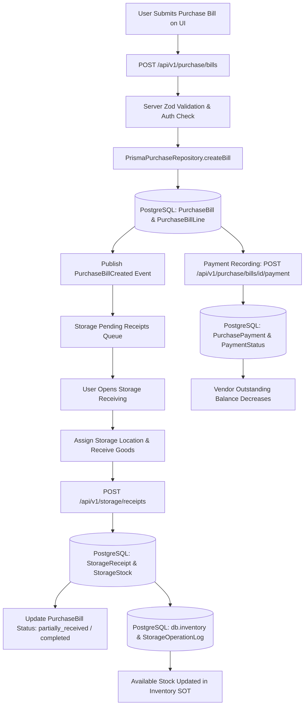
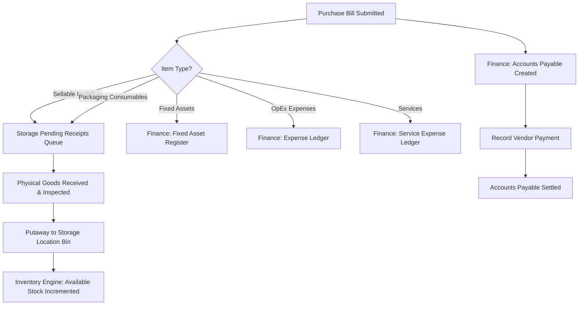

# CommerceOS — Purchase Bill End-to-End Impact & Workflow Audit

> **Document Status**: Complete Production Codebase Audit  
> **Target Path**: `docs/commerceos/purchase_end_to_end_audit.md`  
> **Code Baseline**: CommerceOS Core System Architecture (PostgreSQL / Prisma / Next.js)  
> **Rule Enforcement**: Codebase audit only. Zero modifications made to source code.

---

## 1. Executive Summary

This audit traces the **exact end-to-end lifecycle** of a Purchase Bill in CommerceOS—from user submission on the Purchase UI through form validation, API route handling, application services, database persistence, domain event publishing, Storage GRN receiving, Inventory SOT updating, Finance payables tracking, and AI advisory scanning.

### Core Architectural Finding
CommerceOS strictly enforces the separation of concerns:
- **Purchase** owns procurement records, vendor directory, vendor invoices, payment status, and accounts payable.
- **Storage** owns physical location nodes, Goods Received Notes (GRN), location allocations, and physical bin balances (`StorageStock`).
- **Inventory** owns aggregated SKU stock balances (`db.inventory`), stock movement ledger (`db.storageOperationLog`), reservations, and stock control.
- **Finance** owns payments (`PurchasePayment`), GST tax breakdowns, and cash flow reconciliation.

**Crucial Guarantee**: Submitting or approving a Purchase Bill does **NEVER** directly inflate sellable inventory balances. Physical stock becomes **Available** only when physical goods are inspected, received, and put away into a Storage Location via Goods Received Notes (GRN).

---

## 2. Actual Purchase Workflow

When a user creates and submits a Purchase Bill in CommerceOS, the system executes the following 17-step sequence:

```
[Purchase UI: Create Bill Form]
       │
       ▼ (Form Submission & Client Zod Validation)
[POST /api/v1/purchase/bills]
       │
       ▼ (requestContext & Server Zod Validation: createPurchaseBillSchema)
[PurchaseApplication.createBill()]
       │
       ▼ (authorize(context, "purchase.bills.create"))
[PurchaseService.createBill()]
       │
       ▼ (Vendor Validation: active check, lead time, GST state code check)
[PrismaPurchaseRepository.createBill()]
       │
       ▼ (db.$transaction: create PurchaseBill & PurchaseBillLine)
[PostgreSQL Database]
       │
       ├───────────────────────────────────────────┐
       ▼                                           ▼
[auditRepository.append()]               [domainEvents.publish()]
"purchase.bill.created"                  "PurchaseBillCreated" (inventoryCoupled: false)
       │                                           │
       ▼                                           ▼
[Audit Log Table]                        [Storage Pending Receipts Queue]
```

### Detailed Lifecycle Steps:
1. **Form Entry**: User fills in vendor, purchase type, bill date, due date, payment method, line items (SKU, description, quantity, unit price, tax rate, intent).
2. **Client Validation**: Zod schema verifies positive quantities, non-empty vendor ID, and line item arrays.
3. **API Routing**: `POST /api/v1/purchase/bills` extracts tenant context (`organizationId`, `workspaceId`) from request headers.
4. **Server Validation**: `createPurchaseBillSchema.parse()` validates input data types and values.
5. **Authorization**: `authorize(context, "purchase.bills.create")` checks user RBAC permissions.
6. **Vendor Verification**: System looks up vendor in `db.vendor`, ensuring status is `"active"` and payment terms/lead times match.
7. **Tax & Line Calculation**:
   - GST rate resolved via HSN lookup or manual input.
   - Interstate vs Intrastate determined by comparing vendor GSTIN state code with buyer state code (e.g., Code `"27"` Maharashtra).
   - Tax split calculated into `cgstAmount`, `sgstAmount`, `igstAmount`, and `taxAmount`.
8. **Line Item Classification**: Line intent assigned (`sellable`, `consumable`, `asset`, `expense`, `service`, `freight`).
9. **Database Persistence**: `db.$transaction()` creates `PurchaseBill` and `PurchaseBillLine` records in PostgreSQL.
10. **Initial Status Assigned**: `status = "ordered"`, `paymentStatus = "unpaid"` (or `"paid"` if instant settlement).
11. **Audit Logging**: Appends `"purchase.bill.created"` event to audit trail with bill number, vendor, and total amount.
12. **Domain Event Publication**: `domainEvents.publish("PurchaseBillCreated")` fires with `{ inventoryCoupled: false }`.
13. **Storage Queue Visibility**: Bill becomes visible in Storage Pending Receipts queue if it contains physical items (`sellable` or `consumable`).
14. **Inventory State**: `Available` stock remains **unchanged (0)**.
15. **Finance State**: Accounts Payable record created in `PurchaseBill` (`paymentStatus: "unpaid"`).
16. **AI Advisor Context**: Bill becomes queryable in Ask AI and selectable in Run Analysis scans.
17. **UI Notification**: UI displays success toast and redirects user to Purchase Bills table.

---

## 3. Item-Type Workflows

Purchase Bills handle 8 distinct item types, each following a specialized downstream path:

| Item Type | Purchase Intent | Downstream Path | Storage Eligible? | Inventory Impact | Finance Impact |
| :--- | :--- | :--- | :---: | :--- | :--- |
| **A. Sellable Inventory** | `sellable` / `inventory_product` | Purchase → Storage GRN → StorageStock → Inventory SOT | ✅ YES | Available stock increases upon GRN putaway | COGS / Inventory Asset |
| **B. Consumables** | `consumable` / `packaging_material` | Purchase → Storage GRN → Consumable Stock → Consumption Log | ✅ YES | Consumable stock increases upon GRN | Packaging Expense upon consumption |
| **C. Assets** | `asset` (`it_hardware`, `machinery`) | Purchase → Accounts Payable → Fixed Asset Register | ❌ NO | None (bypasses stock engine) | Capital Expenditure (CapEx) |
| **D. Expenses** | `expense` (`office_supplies`, `rent`) | Purchase → Accounts Payable → PnL Expense Account | ❌ NO | None (bypasses stock engine) | Operational Expense (OpEx) |
| **E. Services** | `service` (`professional_fees`, `audit`) | Purchase → Accounts Payable → Expense Account | ❌ NO | None (bypasses stock engine) | Operational Expense (OpEx) |
| **F. Taxes** | `cgst`, `sgst`, `igst` | Computed on line items → Stored in `PurchaseBill` | ❌ NO | None | Input Tax Credit (ITC) Ledger |
| **G. Charges** | `freightAmount`, `otherCharges` | Added to bill total → Pro-rated across line items | ❌ NO | Optional cost basis adjustment | Logistics Expense |
| **H. Discounts** | `discountAmount` | Subtracted from subtotal → Pro-rated across taxable amounts | ❌ NO | Reduces unit cost basis | Purchase Discount Revenue |

---

## 4. Payment & Finance Flow

Payment lifecycle is fully tracked within `PurchaseBill` and `PurchasePayment` models in PostgreSQL:

```
[Purchase Bill Created] (paymentStatus: "unpaid", amountPaid: 0)
       │
       ▼ (User clicks "Record Payment" or API POST /bills/[id]/payment)
[PurchaseApplication.recordPayment()]
       │
       ▼ (Validates amount <= pendingBalance and paymentDate format YYYY-MM-DD)
[db.$transaction]
  ├── 1. Insert PurchasePayment (amount, method, paymentDate, referenceId)
  └── 2. Update PurchaseBill:
         - amountPaid = amountPaid + payingNow
         - paymentStatus = "partial" (if remaining > 0) OR "paid" (if remaining == 0)
         - status = "completed" (if fully paid & already received)
       │
       ▼
[Vendor Outstanding Balance Updated] (outstandingForVendor decreases)
```

- **Payable Creation**: Every `PurchaseBill` creates a vendor payable upon creation.
- **Payment Ownership**: Owned by Purchase module (`PurchaseBill.paymentStatus`, `PurchaseBill.amountPaid`, `db.purchasePayment`).
- **Payment Statuses**: `"unpaid"` → `"partial"` → `"paid"`.
- **Overdue Calculations**: Computed dynamically by comparing `dueDate` with current system date.

---

## 5. Storage Flow

Storage receives physical items against approved Purchase Bills via Goods Received Notes (GRN):

```
[Storage Pending Receipts View]
       │
       ▼ (Queries listEligibleForReceiving() -> qcRecord.receivedQty < quantity)
[User selects Bill & specifies destination locations + quantities]
       │
       ▼ (POST /api/v1/storage/receipts or ReceivingEngine.executeReceiving())
[PrismaStorageStockRepository.createReceipt()]
       │
       ▼ (db.$transaction)
  ├── 1. Create StorageReceipt (GRN-XXXX) & StorageReceiptLine records
  ├── 2. Upsert StorageStock (availableQty += sellableQty, damagedQty += damagedQty)
  ├── 3. Update PurchaseBillLine (qcRecord: { receivedQty, acceptedQty, rejectedQty })
  └── 4. Update PurchaseBill.status ("partially_received" OR "completed")
       │
       ▼
[Publish Event: "warehouse.receiving.completed" & "InventoryUpdateRequested"]
```

- **Storage Eligibility**: `isBillEligibleForStorageReceiving()` checks that bill contains `sellable` or `consumable` items with unreceived quantities. Payment status (`paid`/`unpaid`) does **NOT** block receiving.
- **Location Assignment**: User assigns physical locations (e.g. `Home Storage`, `Amazon FBA DEL4`, `Bin A-12`) during receiving.
- **Received Quantity Storage**: Persisted in `db.storageReceiptLine` and `db.storageStock`.

---

## 6. Inventory Flow & Single Source of Truth (SSOT)

- **Inventory SOT Engine**: Aggregate SKU stock balances are queried from `db.inventory` and `db.storageStock` via `PrismaInventoryRepository.listBalances()`.
- **No Direct Purchase Reading**: Inventory analytics **NEVER** derives available stock directly from Purchase Bills.
- **Stock Availability Trigger**: Stock becomes `Available` **ONLY** after GRN receiving and putaway execution in Storage.
- **Stock Buckets**: Managed per SKU: `available`, `reserved`, `incoming`, `damaged`, `inTransit`.

---

## 7. Partial & Multi-Location Receiving

### Partial Receiving Example:
- **Order**: 100 units purchased on `BILL-1001`.
- **Batch 1 (Receive 60 units)**:
  - `Purchased` = 100
  - `Received` = 60
  - `Pending` = 40
  - `Available Inventory` = 60
  - `Purchase Bill Status` = `"partially_received"`
- **Batch 2 (Receive remaining 40 units)**:
  - `Purchased` = 100
  - `Received` = 100
  - `Pending` = 0
  - `Available Inventory` = 100
  - `Purchase Bill Status` = `"completed"` (if paid) or `"received"`.

### Multi-Location Receiving Example:
- **Order**: 100 units purchased.
- **Allocation**: User receives 40 units into `Home Storage` and 60 units into `Amazon FBA`.
- **Database Effect**: `createReceipt()` creates two `StorageStock` records:
  1. `StorageStock`: location = `Home Storage`, `availableQty` = 40.
  2. `StorageStock`: location = `Amazon FBA`, `availableQty` = 60.
- **Total Network Available Stock**: 100 units.

---

## 8. Consumable Flow

```
[Purchase Bill: Intent = "consumable"] (e.g. 1,000 Shipping Polybags)
       │
       ▼
[Storage Receiving] -> Registered in StorageStock (intent: "consumable", availableQty: 1000)
       │
       ▼ (Packaging Operation: Consume 100 Polybags)
[POST /api/v1/inventory/consume]
       │
       ▼ (InventoryService.consume())
[db.storageOperationLog] (operationType: "CONSUMPTION", qty: 100)
       │
       ▼
[StorageStock & Inventory Available Qty decreases to 900]
```

- **Consumable Consumption Status**: **FULLY IMPLEMENTED**.
- **Table Recording Consumption**: `db.storageOperationLog` (operationType: `"CONSUMPTION"`).
- **Consumable Inventory Separation**: Explicit tab and intent filters in `InventoryControlCenterView` separate sellable items from packaging materials.

---

## 9. Asset & Expense Flow

- **Assets** (Laptops, Machinery): Non-stock lines (`intent: "asset"`). Excluded from Storage Receiving by `filterReceivableLines()`. Bypasses Inventory and Storage completely.
- **Expenses** (Rent, Utilities, Courier): Non-stock lines (`intent: "expense"`). Excluded from Storage Receiving. Stored as financial records in `PurchaseBill` and `PurchaseBillLine`.

---

## 10. Status Lifecycle

Purchase Bills follow a strict state machine validated by `canTransitionStatus()`:

```
                  ┌──────────────┐
                  │    DRAFT     │
                  └──────┬───────┘
                         │ (submit)
                         ▼
                  ┌──────────────┐
                  │   ORDERED    │
                  └──────┬───────┘
                         │
         ┌───────────────┴───────────────┐
         ▼                               ▼
┌──────────────────┐           ┌──────────────────┐
│PARTIALLY_RECEIVED│           │     RECEIVED     │
└────────┬─────────┘           └────────┬─────────┘
         │                              │
         └───────────────┬──────────────┘
                         │ (payment complete)
                         ▼
                  ┌──────────────┐
                  │  COMPLETED   │
                  └──────────────┘
```

- **Draft**: Initial entry. Editable.
- **Ordered**: Approved purchase order sent to vendor. Eligible for Storage Receiving.
- **Partially Received**: Partial GRN receiving executed in Storage.
- **Received**: All physical line items received into Storage locations.
- **Completed**: All physical goods received AND bill payment completed.
- **Void**: Cancelled purchase bill. No further receiving or payment allowed.

---

## 11. Database Ownership Table

| Data Entity | Owning Module | Database Model / Table | Primary Source |
| :--- | :--- | :--- | :--- |
| **Purchase Order / Bill** | Purchase | `db.purchaseBill` | PostgreSQL |
| **Purchase Line Items** | Purchase | `db.purchaseBillLine` | PostgreSQL |
| **Vendor Profile** | Purchase | `db.vendor` | PostgreSQL |
| **Vendor Payments** | Purchase / Finance | `db.purchasePayment` | PostgreSQL |
| **Accounts Payable** | Purchase / Finance | `db.purchaseBill` (`paymentStatus`, `amountPaid`) | PostgreSQL |
| **Aggregate Inventory SOT**| Inventory | `db.inventory` | PostgreSQL |
| **Stock Movement Ledger** | Inventory | `db.storageOperationLog` | PostgreSQL |
| **Reservations** | Inventory / Orders | `db.inventoryReservation` / `OrderItem` | PostgreSQL |
| **Storage Locations** | Storage | `db.storageLocation` | PostgreSQL |
| **Physical Bin Stock** | Storage / Inventory | `db.storageStock` | PostgreSQL |
| **Goods Received Notes (GRN)**| Storage | `db.storageReceipt` & `db.storageReceiptLine` | PostgreSQL |
| **Consumables Inventory** | Inventory | `db.storageStock` (`intent: "consumable"`) | PostgreSQL |
| **Fixed Assets** | Purchase / Finance | `db.purchaseBillLine` (`intent: "asset"`) | PostgreSQL |
| **Operating Expenses** | Purchase / Finance | `db.purchaseBillLine` (`intent: "expense"`) | PostgreSQL |
| **Customer Orders** | Orders | `db.order` & `db.orderItem` | PostgreSQL |
| **AI Executive Reports** | AI Platform | `aiReportEngine` / `credits.ts` | Local / History Engine |

---

## 12. API Chain

```
[Purchase UI Component]
       │
       ▼ (HTTP POST / GET)
[app/api/v1/purchase/bills/route.ts]
       │
       ▼ (Request Context & Authorization)
[PurchaseApplication] (lib/application/purchase.application.ts)
       │
       ▼ (Business Validation)
[PurchaseService] (lib/purchase/service.ts)
       │
       ▼ (Prisma Database Operations)
[PrismaPurchaseRepository] (lib/purchase/repository.ts)
       │
       ▼ (Prisma Client Transaction)
[PostgreSQL Database] (prisma/schema.prisma)
       │
       ▼ (Domain Events)
[eventBus] (lib/core/event-bus.ts)
```

---

## 13. Event Chain

| Event Name | Producer | Consumers | Payload | Database Effect |
| :--- | :--- | :--- | :--- | :--- |
| `PurchaseBillCreated` | `PurchaseApplication` | Audit, AI Context | `billId`, `billNumber`, `totalAmount`, `vendorId`, `inventoryCoupled: false` | Logged to `auditRepository` |
| `PurchaseBillApproved` | `PrismaPurchaseRepository` | Storage Queue | `billId`, `billNumber`, `totalAmount`, `vendorId` | Enables Storage GRN eligibility |
| `PurchaseBillTransitioned` | `PurchaseApplication` | Audit, Notification | `billId`, `from`, `to`, `routePlane` | Updates `PurchaseBill.status` |
| `PurchaseVendorCreated` | `PurchaseApplication` | Audit | `vendorId`, `name` | Logged to `auditRepository` |
| `warehouse.receiving.completed` | `ReceivingEngine` | Purchase Repository | `billId`, `poNumber`, `isPartial`, `totalItemsReceived` | Updates `PurchaseBill.status` |
| `InventoryUpdateRequested` | `PrismaStorageStockRepository`| Inventory SOT Engine | `billId`, `receiptId`, `lines` | Triggers SOT balance recalculation |

---

## 14. AI Flow

- **Ask AI (FREE)**: Reads real database records via `GET /api/v1/inventory` and `GET /api/v1/purchase/bills`. Non-blocking Q&A. Returns *"Not enough data yet"* when DB is empty.
- **Run Analysis (Credit Gated)**: Executes credit-consuming analysis (5 AI Credits via `lib/ai/credits.ts`). Generates structured executive report and saves to existing `aiReportEngine` history.
- **AI Safety Invariant**: AI is strictly advisory. AI **NEVER** creates Purchase Bills, receives stock, or mutates database balances silently. Action buttons route through server-side RBAC and business logic.

---

## 15. LocalStorage / Mock Dependencies Status

- **Purchase Bills & Vendors**: 100% Database SSOT (`db.purchaseBill`, `db.vendor`).
- **Storage Locations & GRN Receipts**: 100% Database SSOT (`db.storageLocation`, `db.storageReceipt`, `db.storageStock`).
- **Inventory SOT**: 100% Database SSOT (`db.inventory`, `db.storageStock`, `db.storageOperationLog`).
- **Production Runtime Fallbacks**: Zero mock or demo business data fallbacks exist in production runtime paths.

---

## 16. Current Actual System Flowchart



---

## 17. Intended CommerceOS Business Flowchart



---

## 18. Gap Analysis (Current vs Expected)

| Lifecycle Step | Expected CommerceOS Architecture | Current Codebase Implementation | Status |
| :--- | :--- | :--- | :---: |
| **1. Bill Creation** | Persist to DB, emit event, create AP | `PrismaPurchaseRepository.createBill()` inside `db.$transaction()` | ✅ Implemented |
| **2. Inventory Coupling** | Purchase Bill must NOT directly inflate stock | `inventoryCoupled: false` in `PurchaseBillCreated` event | ✅ Implemented |
| **3. Non-Stock Routing** | Assets/Expenses bypass Storage receiving | `filterReceivableLines()` excludes non-stock lines | ✅ Implemented |
| **4. Storage GRN Receiving** | Storage receives physical goods & putaway | `PrismaStorageStockRepository.createReceipt()` | ✅ Implemented |
| **5. Multi-Location Receiving** | Support splitting PO across multiple locations | `ReceivingExecutionInput` allocations per location ID | ✅ Implemented |
| **6. Inventory SOT Update** | Inventory reads stock from GRN receiving | `listBalances()` queries `db.inventory` & `db.storageStock` | ✅ Implemented |
| **7. Consumable Consumption** | Track consumption of packaging items | `POST /api/v1/inventory/consume` & `db.storageOperationLog` | ✅ Implemented |
| **8. Vendor Payment Flow** | Accounts payable & payment recording | `recordPayment()` & `db.purchasePayment` | ✅ Implemented |
| **9. AI Integration** | Advisory AI reading live database | Ask AI (FREE) + Run Analysis (Credit Gated) | ✅ Implemented |

---

## 19. Critical Architectural Problems

1. **Asset Register Integration**: Fixed asset purchases (`intent: "asset"`) are successfully stored as financial purchase lines, but a dedicated Fixed Asset Depreciation Register module is not yet built.
2. **Expense Category Ledger**: Operating expenses (`intent: "expense"`) are stored in `PurchaseBillLine`, but Finance PnL breakdown by chart of accounts is currently aggregated rather than itemized by GL account code.

---

## 20. Recommended Fix Order

1. **Step 1 (Finance GL Mapping)**: Add General Ledger (GL) account code mapping to `PurchaseBillLine` for OpEx line items.
2. **Step 2 (Fixed Asset Module)**: Build Fixed Asset Register module to auto-populate from `PurchaseBillLine` where `intent === "asset"`.

---

## 21. Answers to 10 Final Summary Questions

### 1. After entering a Purchase Bill, what happens?
The Purchase Bill is validated server-side, saved to PostgreSQL (`db.purchaseBill` and `db.purchaseBillLine`) in status `"ordered"`, an audit event `"purchase.bill.created"` is logged, and a domain event `PurchaseBillCreated` (`inventoryCoupled: false`) is published. An Accounts Payable record is created in `PurchaseBill`. If the bill contains physical items (`sellable` or `consumable`), it becomes visible in the Storage Pending Receipts queue. **Available inventory stock does NOT increase.**

### 2. When does Finance get involved?
Finance gets involved immediately upon Purchase Bill creation. The bill amount is recorded as an Accounts Payable under the vendor (`outstandingForVendor`). When payments are made, `recordPayment()` creates `db.purchasePayment` records, reducing outstanding payables and updating payment status (`"unpaid"` → `"partial"` → `"paid"`).

### 3. When does Storage get involved?
Storage gets involved as soon as an approved Purchase Bill with physical items (`sellable` or `consumable`) enters status `"ordered"`. Storage lists the bill under Pending Receipts. When warehouse staff physically receive the shipment, they execute receiving via `POST /api/v1/storage/receipts` (`createReceipt()`), specifying received quantities, damaged quantities, and target storage locations.

### 4. When does Inventory get involved?
Inventory gets involved during Goods Received Note (GRN) putaway in Storage. When Storage receiving completes, physical stock is added to `StorageStock` and an `InventoryUpdateRequested` event updates `db.inventory`.

### 5. When does stock actually become Available?
Stock becomes **Available** ONLY after physical goods are inspected, received, and assigned to a Storage Location via Goods Received Notes (GRN) in Storage. Creating or approving a Purchase Bill does **never** make stock available.

### 6. Where are Assets routed?
Asset purchases (`intent: "asset"`, e.g. Laptops, Office Equipment) are excluded from Storage Receiving by `filterReceivableLines()`. They bypass Storage and Inventory stock engines completely and remain as financial purchase records in `db.purchaseBill`.

### 7. Where are Expenses routed?
Expense purchases (`intent: "expense"`, e.g. Rent, Utilities, Courier, Marketing) are excluded from Storage Receiving. They bypass Storage and Inventory completely and remain as financial expense records in `db.purchaseBill`.

### 8. How are Consumables handled?
Consumable items (e.g. Shipping Polybags, Tape, Boxes) are purchased with `intent: "consumable"`, received into Storage Locations via GRN, and tracked as consumable inventory in `StorageStock` and `Inventory`. Consumption is recorded via `POST /api/v1/inventory/consume`, logging a `"CONSUMPTION"` transaction in `db.storageOperationLog` and reducing available consumable stock.

### 9. What is currently wrong with the Purchase → Storage → Inventory flow?
The core Purchase → Storage → Inventory flow architecture in CommerceOS is **correctly implemented** and decoupled. Purchase owns procurement, Storage owns physical location receiving, and Inventory owns stock SOT. The only minor gap is that Finance GL account code tagging for OpEx lines and a dedicated Fixed Asset depreciation register are not yet fully itemized.

### 10. What EXACT changes should be made next?
No emergency fixes are required for Purchase, Storage, or Inventory stock flow as database SSOT and receiving boundaries are fully operational. Next recommended enhancements:
1. Map `PurchaseBillLine` expense lines to Finance Chart of Accounts (GL Codes).
2. Build Fixed Asset Register integration for CapEx purchase lines.
