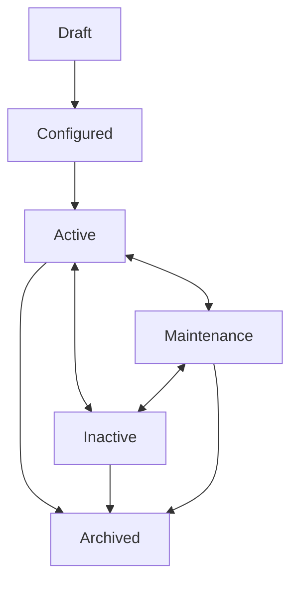

# CommerceOS V4 — Storage Foundation Specification (Phase 2)
## Universal Storage Location Engine Architecture

## Executive Summary & Role Statement

This document defines the **Universal Storage Location Engine (Phase 2)** specification for CommerceOS V4. The engine manages physical and virtual inventory locations across all seller personas (Solo Seller, Growing D2C Brand, Enterprise Retailer).

---

## 1. Engine Core & Subsystem Responsibilities

The Universal Storage Location Engine is comprised of 8 decoupled domain engines:

| Subsystem Engine | Primary Responsibility |
| :--- | :--- |
| **StorageLocationEngine** | Central facade for location registration, updates, activations, archivals, search, hierarchy tree management, and event publishing. |
| **LifecycleEngine** | State machine enforcing valid status transitions (`Draft` $\to$ `Configured` $\to$ `Active` $\rightleftarrows$ `Maintenance` $\rightleftarrows$ `Inactive` $\to$ `Archived`). |
| **ValidationEngine** | Invariant rule engine validating code uniqueness, duplicate names, reserved system keywords, circular parent references, archived parents, and capability conflicts. |
| **CapabilityResolver** | Dynamic resolver determining capability availability based on location type, operational state, and custom overrides. |
| **HierarchyResolver** | Tree topology engine managing multi-level parent-child relationships, ancestor path resolution, and cycle detection. |
| **SearchEngine** | Multi-attribute search and filter engine across 9 location metadata facets. |
| **LabelGeneratorEngine** | Structured auto-code generator formatting standardized identifiers (e.g. `HOME-001`, `AMZ-DEL4`, `FK-BOM1`, `WH-BLR-01`, `3PL-MUM-01`, `RET-001`, `FAC-001`, `TRN-001`). |
| **AuditEngine** | Immutable audit trail logger recording `who`, `when`, `what`, `oldValue`, `newValue`, and `reason` for all state mutations. |

---

## 2. Location Lifecycle State Machine

Locations progress through 6 formal lifecycle states:



1. `Draft`: Newly initialized location record undergoing setup.
2. `Configured`: Settings, address, and capabilities specified, ready for activation.
3. `Active`: Operational location actively handling stock transfers and processes.
4. `Maintenance`: Temporary operational pause for maintenance or stock audits.
5. `Inactive`: Deactivated location node (no active processes allowed).
6. `Archived`: Terminal state. Location is archived and immutable.

---

## 3. Location Hierarchy Topology

Supports infinite depth parent-child topology:

```
Company Organization Node
└── Central Logistics Network
      ├── Home Storage Node (HOME-001)
      ├── Regional Fulfillment Center (WH-BLR-01)
      │     ├── Zone A (Rack R01)
      │     └── Zone B (Bin B04)
      ├── Amazon FBA Fulfillment Center (AMZ-DEL4)
      ├── Flipkart FBF Hub (FK-BOM1)
      ├── SafeExpress 3PL Park (3PL-MUM-01)
      └── Seasonal Staging Buffer (TMP-001)
```

---

## 4. Audit & Security Contracts

Every state mutation records an immutable audit log:

```typescript
interface StorageAuditRecord {
  id: string;
  locationId: string;
  action: string;
  actorId: string;
  actorName: string;
  timestamp: string; // ISO 8601
  fieldChanged: string;
  oldValue: unknown;
  newValue: unknown;
  reason?: string;
  securityContext: SecurityContext;
}
```
